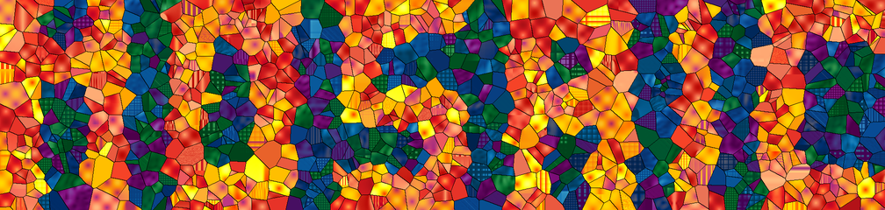
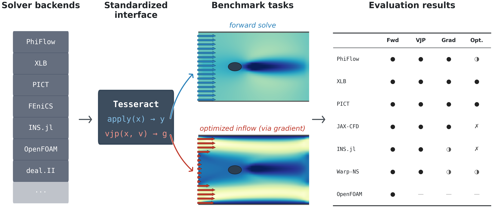

<p align="center">
  
</p>

# Mosaic

**A benchmark suite and reusable collection of differentiable physics solvers.** <br>
Think OpenAI Gym, but for differentiable physics: a growing catalog of tasks across physical domains, with a standardized interface and evaluation protocol for every solver and their gradients.

<a href="https://docs.pasteurlabs.ai/projects/mosaic/stable/docs/results_ns_grid.html"></a>
<a href="#run-the-benchmarks"></a>
<a href="#use-tesseracts-in-your-own-code"></a>
<a href="#contribute"></a>
<a href="https://docs.pasteurlabs.ai/projects/mosaic/stable/"></a>
<a href="https://arxiv.org/abs/XXXX.XXXXX"></a>
<a href="LICENSE"></a>



## What Mosaic measures

If you optimize or train _through_ a physics simulation, the solver must return two correct things: the forward prediction **and** its gradient (the vector–Jacobian product, VJP). Most benchmarks check only the forward pass. Mosaic checks both, and scores every solver on three axes:

- **Gradient accuracy** — does the VJP match a finite-difference ground truth?
- **Computational cost** — wall-clock time (forward + VJP) and peak memory.
- **Setup compatibility** — does the solver even _run_ on the task, or do structural constraints rule it out?

Each solver is packaged as a [Tesseract](https://github.com/pasteurlabs/tesseract-core) container exposing a uniform `apply` / `vjp` interface. A single harness can therefore compare solvers across languages and AD backends (JAX, PyTorch, Julia, hand-written C++ adjoints) by talking only to that common interface.

## Domains & solvers

| ID     | Domain                     | Optimization task              | Solvers                                                |
| :----- | :------------------------- | :----------------------------- | :----------------------------------------------------- |
| **H**  | Heat transfer              | Conductivity inversion         | deal.II, FEniCS, Firedrake, JAX-FEM, torch-fem         |
| **S**  | Structural mechanics       | Compliance minimization (SIMP) | deal.II, FEniCS, Firedrake, JAX-FEM, TopOpt.jl         |
| **F2** | Incompressible fluids (2D) | Inflow optimization (drag)     | JAX-CFD, PhiFlow, INS.jl, XLB, PICT, Warp-NS, OpenFOAM |
| **F3** | 3D Navier–Stokes           | Initial condition recovery     | PhiFlow, XLB, PICT, Warp-NS, Exponax, INS.jl, OpenFOAM |

## 📊 Results

**[Browse the benchmark results →](https://docs.pasteurlabs.ai/projects/mosaic/stable/docs/results_ns_grid.html)** — no setup required.

Per-domain pages with every plot, solver rankings, and the full evaluation protocol, refreshed on each release:
[Navier–Stokes 2D](https://docs.pasteurlabs.ai/projects/mosaic/stable/docs/results_ns_grid.html) ·
[Navier–Stokes 3D](https://docs.pasteurlabs.ai/projects/mosaic/stable/docs/results_ns_3d_grid.html) ·
[Structural mechanics](https://docs.pasteurlabs.ai/projects/mosaic/stable/docs/results_structural_mesh.html) ·
[Heat transfer](https://docs.pasteurlabs.ai/projects/mosaic/stable/docs/results_thermal_mesh.html)

## 📖 Documentation

Two versions are published. **You most likely want to use [stable](https://docs.pasteurlabs.ai/projects/mosaic/stable/) — it tracks the latest release and is the most reliable (all solvers benchmarked in the same run).** [Latest](https://docs.pasteurlabs.ai/projects/mosaic/latest/) tracks the `main` branch and may aggregate results from different runs.

Start here:
[Getting Started](https://docs.pasteurlabs.ai/projects/mosaic/stable/docs/getting-started.html) ·
[Use Solvers Elsewhere](https://docs.pasteurlabs.ai/projects/mosaic/stable/docs/standalone.html) ·
[Solver Reference](https://docs.pasteurlabs.ai/projects/mosaic/stable/docs/solvers.html) ·
[How it works](https://docs.pasteurlabs.ai/projects/mosaic/stable/docs/internals.html) ·
[Add a Backend](https://docs.pasteurlabs.ai/projects/mosaic/stable/docs/tutorial.html)

> [!TIP]
> **Reproducing our paper?** See the [`v0.1+paper-repro`](https://github.com/pasteurlabs/mosaic/tree/v0.1+paper-repro) tag for figure-generation code, pinned dependencies, and step-by-step instructions.

---

## Run the benchmarks

**Requires** Python ≥ 3.10, Docker, and — for GPU solvers — the [NVIDIA Container Toolkit](https://docs.nvidia.com/datacenter/cloud-native/container-toolkit/install-guide.html).

> [!WARNING]
> We strongly recommend **Linux with Docker Engine**. Docker Desktop on macOS/Windows runs containers in a VM, adding significant overhead and ARM compatibility issues on Apple Silicon. On macOS/Windows, prefer a Linux VM or WSL 2 with Docker Engine installed natively.

```bash
git clone https://github.com/pasteurlabs/mosaic && cd mosaic
uv sync          # or: pip install -e .
mosaic run       # builds containers, runs experiments, generates plots
```

**Verify your setup** with a single-problem `--debug` run (reduced grid sizes, finishes in minutes):

```bash
$ mosaic run -p thermal-mesh --suites forward --debug
──────────────────────────── problem: thermal-mesh ─────────────────────────────
──────────────────────────────────── build ─────────────────────────────────────
  deal.II          → dealii_heat_thermal_mesh:latest     (3.6s)
  FEniCS           → fenics_heat_thermal_mesh:latest     (3.2s)
  Firedrake        → firedrake_heat_thermal_mesh:latest  (2.4s)
  JAX-FEM          → jax_fem_thermal_mesh:latest         (5.1s)
  torch-fem        → torch_fem_thermal_mesh:latest       (4.8s)
─────────────────────────────────── summary ────────────────────────────────────
┏━━━━━━━━━━━━━━┳━━━━━━━━━┓
┃ problem      ┃ forward ┃
┡━━━━━━━━━━━━━━╇━━━━━━━━━┩
│ thermal-mesh │   ok    │
└──────────────┴─────────┘
```

<details>
<summary><strong>Common workflows</strong> — inspect results, pick solvers, re-run a subset</summary>

#### Inspect results

```bash
mosaic status                        # per-experiment completion table
mosaic status -p ns-grid -f          # single domain with failure reasons
mosaic status --format md > report.md
mosaic status --format json > snap.json
```

#### Pick which solvers run

`-s` / `--solvers` takes either a flat CSV (union across every problem) or a per-problem map:

```bash
# Flat CSV — each problem keeps only the listed solvers that exist there.
mosaic run -s OpenFOAM,XLB,deal.II,JAX-FEM

# Per-problem map — explicit picks per domain.
mosaic run -s "ns-grid=XLB,jax-cfd;structural-mesh=Firedrake,JAX-FEM"
```

#### Re-run a subset

`mosaic run --only <state[,…]>` re-executes only cells in the given state, leaving fresh-ok cells alone — handy for iterating on one solver or recovering from a partial failure.

```bash
mosaic run --only failed              # re-run only failed cells
mosaic run --only failed,stale        # plus anything invalidated by the harness/source
mosaic run --only missing             # first-time runs only
mosaic run -s PhiFlow --only excluded # re-check after dropping an exclusion
```

States: `failed`, `anom`, `missing`, `stale`, `excluded`. Combine with `-p` / `--suites` / `-e` / `-s` for finer scoping.

</details>

The full CLI reference and smoke-test workflow live in [Getting Started](https://docs.pasteurlabs.ai/projects/mosaic/stable/docs/getting-started.html).

## Use Tesseracts in your own code

Every solver is a standalone [Tesseract](https://github.com/pasteurlabs/tesseract-core) you can call from your own research code — no benchmark harness required.

```bash
# Shared schemas (deps: pydantic + tesseract-core only)
pip install -e mosaic/mosaic_shared

# For containerised usage (recommended): also install tesseract-jax
pip install tesseract-core tesseract-jax jax
```

**Via container** (works for every solver regardless of language). Build the image once, then call it from JAX with full `grad` support:

```python
import jax
import jax.numpy as jnp
from tesseract_core import Tesseract
from tesseract_jax import apply_tesseract
from mosaic_shared.problems.navier_stokes_grid.schemas import make_vortex_ic

ic = make_vortex_ic(N=64, seed=42)
inputs = {"v0": ic, "viscosity": jnp.array([0.01]), "steps": 50}

with Tesseract.from_image("exponax_navier_stokes_grid:latest") as t:
    outputs = apply_tesseract(t, inputs)
    grad_v0 = jax.grad(lambda v0: jnp.mean(
        apply_tesseract(t, {**inputs, "v0": v0})["result"] ** 2
    ))(inputs["v0"])
```

A **local (no Docker)** path is also available for Python-only solvers — see the full guide below.

📖 [Standalone Usage](https://docs.pasteurlabs.ai/projects/mosaic/stable/docs/standalone.html) (GPU, mesh-based solvers, gotchas) · [Solver Reference](https://docs.pasteurlabs.ai/projects/mosaic/stable/docs/solvers.html) (per-solver catalog with image names)

<details>
<summary><strong>Programmatic API</strong> — run evaluations without the CLI</summary>

```python
from mosaic import get_config, PROBLEMS

cfg = get_config("ns-grid")           # Problem for 2-D Navier-Stokes
print(cfg.solver_names)               # available solver backends

# Each (suite, experiment) is registered on the Problem as an Experiment
# closure. Invoke one directly with a {solver_name: image_tag} mapping:
tags = {s.name: s.image_tag for s in cfg.solvers}
results = cfg.experiments["gradient/fd_check"].fn(cfg, tags)
```

Top-level imports: `PROBLEMS`, `get_config`, `Problem`, `SolverSpec`, `IcSpec`, and the shared suite-kernel modules `forward`, `gradient`, `cost`, `optimization` (from `mosaic.benchmarks.problems.shared`).

</details>

## Contribute

Mosaic is designed to grow with the community. Three ways in, roughly by scope:

- **Tune an existing solver** — improve an out-of-the-box config. Snapshot `mosaic status --format json` before/after and include the diff. → [CONTRIBUTING.md](CONTRIBUTING.md#tuning-an-existing-solver)
- **Add a solver** to an existing domain — three files under `mosaic/tesseracts/<domain>/<solver-name>/`. → [Add a Solver tutorial](https://docs.pasteurlabs.ai/projects/mosaic/stable/docs/tutorial.html#part-a--add-a-solver-to-an-existing-domain)
- **Add a benchmark domain** — scaffold with `mosaic new-domain <name> --from-template <template>`. → [Add a Domain tutorial](https://docs.pasteurlabs.ai/projects/mosaic/stable/docs/tutorial.html#part-b--add-a-new-benchmark-domain)

[CONTRIBUTING.md](CONTRIBUTING.md) covers code style, the PR workflow, and building the docs locally. For questions, visit the [Tesseract Forum](https://si-tesseract.discourse.group/).

## Project structure

```
mosaic/
  benchmarks/             # evaluation harness (Python package: mosaic.benchmarks)
    cli.py                # command-line interface
    core/                 # runner, config, hardware detection, solver auto-discovery
    problems/             # per-domain packages (ns-grid, ns-3d-grid, structural-mesh, thermal-mesh)
      shared/             # cross-domain suite kernels (forward, gradient, cost, optimization) + plots
    plots/                # plotting infrastructure
  templates/              # task templates for scaffolding new domains
  tesseracts/             # solver backends (each is a Tesseract container)
    mosaic_shared/        # shared Tesseract interface schemas (also pip-installable)
    navier-stokes-grid/   # JAX-CFD, PhiFlow, XLB, PICT, Warp-NS, etc.
    structural-mesh/      # deal.II, FEniCS, Firedrake, JAX-FEM, TopOpt.jl
    thermal-mesh/         # deal.II, FEniCS, Firedrake, JAX-FEM, torch-fem
  tests/                  # unit tests (run with pytest)
docs/                     # Quarto documentation site
```

## License

Apache 2.0. Individual solver backends retain their upstream licenses, documented per solver in the repository.
