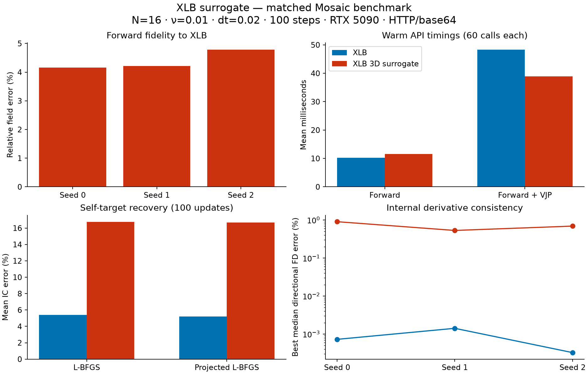

# Standalone XLB surrogate: matched Mosaic results

Validation for `feat/standalone-xlb-surrogate`, based on main `6ce99c0`.
Final source commit: `a0065ede7b5ec3267105d56d071e0cb97cb47b7c`.
The final commit adds the fixed-cost plot renderer after the numerical run;
`executed-source-sha256.json` records the exact executed API/model/config files.

Slurm job **2869896** completed all 14 registered cells on one NVIDIA RTX 5090,
using three held-out IC seeds (0, 1, 2), N=16, nu=0.01, dt=0.02, 100 steps.
Both recovery variants used 100 updates from zero. Each timing operation used
20 warmed trials per seed, 60 per solver in total.

| Metric | XLB | XLB 3D surrogate |
| --- | ---: | ---: |
| Mean forward relative field error vs XLB | reference | 4.39% |
| Mean IC error, L-BFGS | 5.38% | 16.74% |
| Mean IC error, projected L-BFGS | 5.21% | 16.67% |
| Forward API mean / median | 10.26 / 10.27 ms | 11.57 / 10.32 ms |
| Forward + VJP API mean / median | 48.31 / 48.37 ms | 38.92 / 38.32 ms |
| Best-epsilon median directional FD error (seed range) | 0.00033–0.00142% | 0.532–0.904% |

Internal FD consistency is distinct from teacher-gradient fidelity. Comparing
the saved full gradients of each solver's own `sum(u_T**2)` objective gives
relative L2 differences of **222%, 207%, 150%**, with cosines **0.405, 0.438,
0.568**. These are objective-gradient differences, not full-Jacobian errors
or VJPs with a shared output cotangent. Snapshot/directional-gradient
consistency was checked against the stored FD experiment vectors.

Timing includes HTTP/base64 transport and a CPU JAX client. XLB keeps its native
float64 path; the surrogate is float32. One allocation, fixed solver order,
and repeated calls do not establish a general hardware-independent speedup.
The services used existing runtime images (`xlb-2853707.sqsh` and
`xlb-3d-surrogate-1696556.sqsh`) with current source/API/shared model/weights
mounted in. This does not validate a fresh image build. The generated Docker
build context was checked separately and includes the expected inference
files and checkpoint.

The checkpoint SHA-256 remains
`1ea04a7333981d1bfb836461d6fd6d89ae12f31c64ea40701c2607f03fb4107f`.
No retraining or checkpoint selection was performed.

The `ns-3d-grid` directory contains the normal result/parameter envelopes,
field snapshots, and standard forward/gradient/cost plots. `manifest.json`
records client versions and the completed cells. `summarize.py` regenerates
`summary.json` and `comparison.png` from those artifacts. The three launch
scripts preserve the offline cluster orchestration separately from Mosaic.

Validation: full local suite 655 passed / 3 skipped (Docker unavailable),
followed by 33 passing focused tests including the new fixed-cost plot
regression; Ruff lint and format checks passed across `mosaic` and `tests`.
