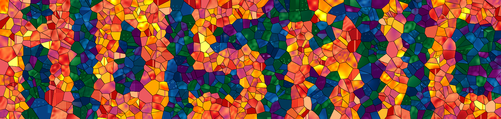

{width=100% style="max-width:600px; display:block; margin:0 auto 1.5rem;"}

An extensible benchmark framework for differentiable physics solvers that treats gradient quality as a first-class criterion alongside forward accuracy and throughput. Built on [tesseract-core](https://github.com/pasteurlabs/tesseract-core), which wraps each solver in a Docker container exposing a uniform `apply` / `vjp` interface, and [tesseract-jax](https://github.com/pasteurlabs/tesseract-jax), which calls those containers as native JAX functions (with full JIT and `grad` support) from the benchmark harness. This enables comparison across incompatible AD backends (JAX, PyTorch, Julia Zygote, C++) without shared dependencies.

## Benchmark domains

| ID | Domain | Optimization task | Control dim. | Backends |
|:---|:-------|:------------------|:-------------|:---------|
| **H** | Heat transfer | Conductivity inversion | 128 | [deal.II](solvers.qmd#thermal-mesh-dealii-heat), [FEniCS](solvers.qmd#thermal-mesh-fenics-heat), [Firedrake](solvers.qmd#thermal-mesh-firedrake-heat), [JAX-FEM](solvers.qmd#thermal-mesh-jax-fem), [torch-fem](solvers.qmd#thermal-mesh-torch-fem) |
| **S** | Structural mechanics | Compliance minimization (SIMP) | 2048 | [deal.II](solvers.qmd#structural-mesh-dealii), [FEniCS](solvers.qmd#structural-mesh-fenics), [Firedrake](solvers.qmd#structural-mesh-firedrake), [JAX-FEM](solvers.qmd#structural-mesh-jax-fem), [TopOpt.jl](solvers.qmd#structural-mesh-topopt-jl) |
| **F2** | Incompressible fluids (2D) | Inflow optimization for drag min. | 32 | [JAX-CFD](solvers.qmd#navier-stokes-grid-jax-cfd), [PhiFlow](solvers.qmd#navier-stokes-grid-phiflow), [INS.jl](solvers.qmd#navier-stokes-grid-ins-jl), [XLB](solvers.qmd#navier-stokes-grid-xlb), [PICT](solvers.qmd#navier-stokes-grid-pict), [Warp-NS](solvers.qmd#navier-stokes-grid-warp-ns), [OpenFOAM](solvers.qmd#navier-stokes-grid-openfoam) |
| **F3** | 3D Navier-Stokes | Initial condition recovery | 12288 | [PhiFlow](solvers.qmd#navier-stokes-grid-phiflow), [XLB](solvers.qmd#navier-stokes-grid-xlb), [PICT](solvers.qmd#navier-stokes-grid-pict), [Warp-NS](solvers.qmd#navier-stokes-grid-warp-ns), [Exponax](solvers.qmd#navier-stokes-grid-exponax), [INS.jl](solvers.qmd#navier-stokes-grid-ins-jl), [OpenFOAM](solvers.qmd#navier-stokes-grid-openfoam) |

## Evaluation protocol

Four suites run end-to-end across every solver–domain pair:

- **forward** — `baseline`, `agreement`, `physical_laws`
- **cost** — `spatial_cost`, `temporal_cost`, `vjp_cost`
- **gradient** — `fd_check`, `param_sweep`, `horizon_sweep`, `jacobian_svd`
- **optimization** — `topopt`, `drag_opt`, `recovery`

The [Architecture](architecture.qmd) page describes the Tesseract interface and the per-suite metrics in detail.

## Solver backends

Each solver is wrapped as a Tesseract: a containerized component exposing `apply(inputs) -> outputs` and `vector_jacobian_product(inputs, cotangents) -> vjp`. The container isolates all dependencies (language, libraries, GPU runtime).

See the [Solver Reference](solvers.qmd) for the full catalog — per-solver numerical scheme, AD strategy, image name, schema fields, and known limitations.

---

→ Head over to **[Getting Started](getting-started.qmd)** for installation, prerequisites, the smoke-test workflow, and the full CLI reference.
