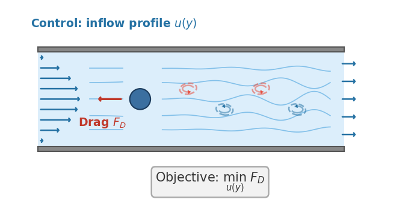
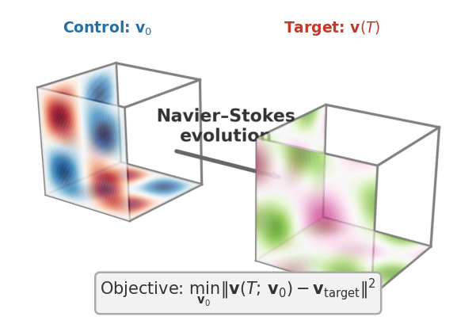
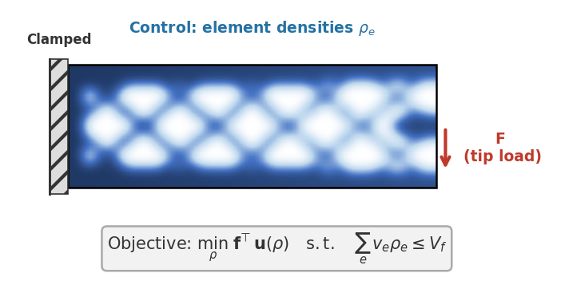
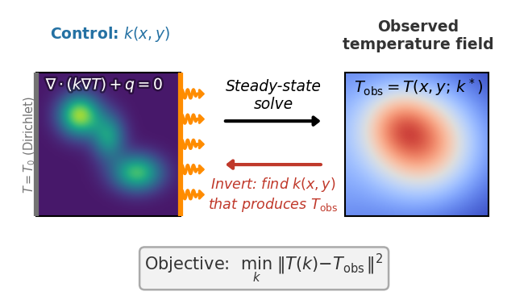

Benchmark results for every domain, with embedded plots, a best-solver ranking
per category, and the task setup. Pick a domain below.

::: {.callout-tip appearance="simple"}
These are **example results**, produced automatically on GitHub Actions runners
and refreshed on every release. Accuracy and gradient metrics are
hardware-independent and reproducible; wall-clock numbers reflect commodity
cloud hardware and are best read as relative scaling between solvers. For
numbers that reflect *your* setup, [run the benchmarks
yourself](getting-started.qmd) on your target hardware.
:::

## Scoreboard {#scoreboard}

Solvers ranked within each physics domain, scored from 0 to 100 on every axis.
Click a column header to re-sort, a solver to open its card, or a results link
to open the domain's page.

::: {.column-page}

:::

::: {.callout-note collapse="true" title="How the scores are computed"}
Each solver gets five axis scores per domain, each from 0 to 100:

- **Forward** — mean relative error against the reference solution, as digits
  of accuracy out of six: $-\log_{10}(\text{error})/6$, so an error of
  $10^{-6}$ or below scores 100 and an error of 100% scores 0.
- **Gradient** — the best-$\varepsilon$ finite-difference error of the
  gradient, on the same digits-of-accuracy scale.
- **Cost** — forward and VJP wall-clock time compared against the fastest
  solver at each problem size $N$ separately, $1 - \log_{10}(t/t_\text{best})/3$
  (three decades slower scores 0). A size the solver did not complete scores 0.
- **Optimization** — the improvement the optimizer achieved through the
  solver's gradients (final / initial objective), as a fraction of the best
  solver's improvement in decades. Where no initial objective is recorded, final
  objectives are compared directly.
- **Reliability** — the campaign-health weights used by `mosaic status`
  (ok 1, anomaly 0.53, not run 0.33, failed 0; permanent exclusions left out),
  averaged over every experiment the solver takes part in.

An axis on which a solver has no result scores 0. That is mostly gradient and
optimization for forward-only solvers (deal.II, OpenFOAM) and optimization
tasks a solver cannot set up, since gradient quality is a first-class criterion
here. A domain score is the unweighted mean of the five axes, and solvers
are ranked on it within each domain; Navier–Stokes 2D and 3D are ranked
separately. Domains are not ranked against each other: the finite-element problems
are easier to solve accurately than turbulent flow, so scores are only
comparable within a domain.
:::

## Domains

::: {.domain-grid .column-page}
::: {.domain-card}
::: {.domain-thumb}
{.nolightbox fig-alt="Navier–Stokes 2D task schematic"}
:::
::: {.domain-card-body}
[F2]{.domain-id .d-F2}

[[Navier–Stokes (2D)](results_ns_grid.qmd)]{.domain-card-title}

Optimize the inflow of a 2D channel flow to minimize drag on a cylinder,
differentiating through an incompressible fluid solver. Covers JAX-CFD,
PhiFlow, INS.jl, XLB, PICT, Warp-NS, and OpenFOAM across spectral,
finite-difference, finite-volume, and LBM schemes.
:::
:::

::: {.domain-card}
::: {.domain-thumb}
{.nolightbox fig-alt="Navier–Stokes 3D task schematic"}
:::
::: {.domain-card-body}
[F3]{.domain-id .d-F3}

[[Navier–Stokes (3D)](results_ns_3d_grid.qmd)]{.domain-card-title}

Recover the initial velocity field of a 3D turbulent flow from a later snapshot,
differentiating through the Navier–Stokes rollout. Covers PhiFlow, XLB, PICT,
Warp-NS, Exponax, INS.jl, and OpenFOAM on a triply periodic Taylor–Green vortex.
:::
:::

::: {.domain-card}
::: {.domain-thumb}
{.nolightbox fig-alt="Structural mechanics task schematic"}
:::
::: {.domain-card-body}
[S]{.domain-id .d-S}

[[Structural mechanics](results_structural_mesh.qmd)]{.domain-card-title}

Place a fixed budget of material in a clamped beam to make it as stiff as
possible, differentiating through a finite-element solve. Covers deal.II,
FEniCS, Firedrake, JAX-FEM, and TopOpt.jl on 2D cantilever compliance
minimization with SIMP penalization.
:::
:::

::: {.domain-card}
::: {.domain-thumb}
{.nolightbox fig-alt="Heat transfer task schematic"}
:::
::: {.domain-card-body}
[H]{.domain-id .d-H}

[[Heat transfer](results_thermal_mesh.qmd)]{.domain-card-title}

Invert for the conductivity field of a slab from its temperature,
differentiating through a steady heat-conduction solve. Covers deal.II, FEniCS,
Firedrake, JAX-FEM, and torch-fem on 2D steady-state heat conduction.
:::
:::
:::

## Experiment explorer {#explorer}

Every experiment across all domains. Search or filter, then click a card to see
its plots.

::: {.column-page}

:::

## What each page reports

Every domain page scores its solvers on four axes:

- **Forward** — is the prediction right? Output vs. a trusted reference (and an
  analytic solution where one exists).
- **Gradient** — is the gradient right? AD/adjoint gradient vs. a
  finite-difference ground truth (magnitude and direction).
- **Cost** — what does it cost? Forward and VJP wall-clock scaling with problem
  size.
- **Optimization** — can you optimize through it? End-to-end convergence using
  each solver's own gradients.

See the [Overview](index.qmd#evaluation-protocol) for the full evaluation
protocol.
