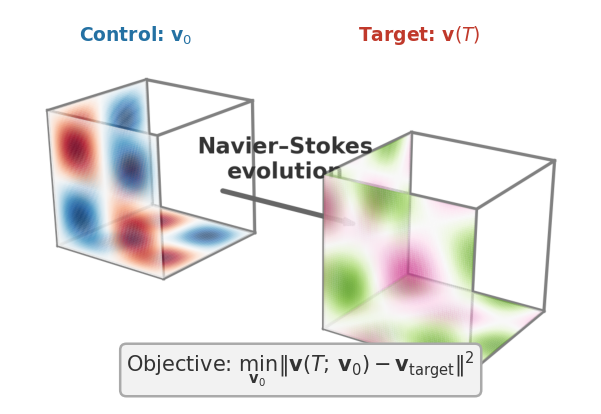

> Auto-generated 2026-06-15 19:21 UTC &nbsp;·&nbsp; 9 plots

{width=100% style="max-width:560px; display:block; margin:0 auto 0.5rem;"}

*Recover the initial velocity field of a 3D turbulent flow from a later snapshot, differentiating through the Navier–Stokes rollout.*

**Fluid flow in 3D.** The 3D counterpart of the 2D fluid problem, and the harder stress test for differentiable simulation: real turbulence lives in 3D, and the gradients are correspondingly more delicate.

We solve the 3D incompressible Navier–Stokes equations $\partial_t \mathbf{u} + (\mathbf{u}\cdot\nabla)\mathbf{u} = -\nabla p + \nu\,\nabla^2\mathbf{u}$, $\nabla\cdot\mathbf{u}=0$, with viscosity $\nu$ as the primary control parameter. Unlike 2D, the 3D equations admit *vortex stretching*, which amplifies vorticity and brings on chaos far sooner: the chaos horizon is $T^\ast \approx 8\text{–}16$ s versus $T^\ast > 64$ s in 2D (at $\nu=10^{-3}$, $N=16$). As a result gradient norms *grow* along the rollout here rather than decaying as they do in 2D.

::: {.callout-tip title='How these results were produced' collapse='true'}

These are **example results**, produced automatically on GitHub Actions runners and refreshed on every release. Each solver runs on its intended device: GPU-capable solvers on a Tesla T4 GPU node, CPU-only solvers (OpenFOAM, deal.II, FEniCS, Firedrake) on a CPU node. Accuracy and gradient metrics are hardware-independent and reproducible. Wall-clock numbers reflect commodity cloud hardware and can vary by 10–15% between runs, so read them for relative scaling between solvers rather than as absolute timings. For numbers that reflect *your* setup, [run the benchmarks yourself](getting-started.qmd) on your target hardware.

:::

::: {.callout-note title='Boundary conditions'}

Triply-periodic cubic domain $[0, 2\pi]^3$ (the flow wraps around on all three axes). Incompressibility $\nabla\cdot\mathbf{u}=0$ is enforced by a pressure projection at each time step. No walls or inflow/outflow boundaries.

:::

## Initial Conditions

Visualisation of each initial condition (the starting field a run is launched from) available for this problem. IC plots are generated without running any solver.


::: {.callout-note collapse='true' title='Settings'}

**Abc**

```json
{
  "N": 32
}
```

**Rand Div Free**

```json
{
  "N": 32
}
```

**Tgv3D**

```json
{
  "N": 32
}
```

:::

{.lightbox}

## Forward

**Is the prediction right?** Forward-pass benchmarks check each solver's output against a trusted reference (and an analytic solution where one exists): inter-solver agreement, field-level diagnostics, and long-run stability.

### Agreement

3D velocity magnitude fields and kinetic energy spectra per solver, swept over viscosity ν, compared against the analytic TGV reference.


::: {.callout-note collapse='true' title='Settings'}

Sweeps `nu` ∈ {0.001, 0.01, 0.05}

```json
{
  "ic": {
    "name": "tgv3d",
    "seed": 0
  },
  "physics": {
    "N": 16,
    "nu": 0.001,
    "dt": 0.01,
    "steps": 50,
    "lbm_N_base": 16
  },
  "sweep": {
    "key": "nu",
    "values": [
      0.001,
      0.01,
      0.05
    ]
  }
}
```

:::

{.lightbox}

### Baseline

Relative error vs grid resolution N at steps=1; validates single-step forward accuracy across 3D solvers.


::: {.callout-note collapse='true' title='Settings'}

Sweeps `N` ∈ {8, 16, 32}

```json
{
  "ic": {
    "name": "tgv3d",
    "seed": 0
  },
  "physics": {
    "N": 8,
    "nu": 0.05,
    "dt": 0.01,
    "steps": 1
  },
  "sweep": {
    "key": "N",
    "values": [
      8,
      16,
      32
    ]
  }
}
```

:::

{.lightbox}

**Solver ranking**

::: {.sortable-table}
| Solver | Mean rel. error |
|---|---|
| PICT | 1.13e-01 |
| PhiFlow | 1.15e-01 |
| Warp-NS | 1.18e-01 |
| XLB | 1.19e-01 |
| Exponax | 1.20e-01 |
:::

*Ranked by mean relative error against the reference solution (lower is more accurate).*

## Cost

**What does it cost?** Wall-clock scaling of the forward and VJP passes with problem size $N$ and the number of integration steps. Timings come from dedicated runners with no concurrent workloads; see the reliability note at the top of the page before reading absolute numbers.


::: {.callout-note collapse='true' title='Settings'}

**Spatial Cost**

Sweeps `N` ∈ {16, 32, 48, 64}

```json
{
  "physics": {
    "nu": 0.01,
    "dt": 0.01,
    "lbm_N_base": 16,
    "steps": 50,
    "N": 16
  },
  "cost": {
    "n_trials": 3
  },
  "sweep": {
    "key": "N",
    "values": [
      16,
      32,
      48,
      64
    ]
  }
}
```

**Temporal Cost**

Sweeps `steps` ∈ {10, 50, 100}

```json
{
  "physics": {
    "nu": 0.01,
    "dt": 0.01,
    "lbm_N_base": 16,
    "N": 48,
    "steps": 10
  },
  "cost": {
    "n_trials": 3
  },
  "sweep": {
    "key": "steps",
    "values": [
      10,
      50,
      100
    ]
  }
}
```

:::

{.lightbox}

**Solver ranking**

::: {.sortable-table}
| Solver | Forward time | VJP time |
|---|---|---|
| PICT | 1.19 s @ N=64 | 4.48 s @ N=64 |
| Exponax | 1.53 s @ N=64 | 5.88 s @ N=64 |
| Warp-NS | 2.2 s @ N=64 | 6.65 s @ N=64 |
| PhiFlow | 3.33 s @ N=32 | 10.1 s @ N=32 |
| INS.jl | 10.3 s @ N=64 | 77.4 s @ N=64 |
| OpenFOAM | 26.3 s @ N=64 | — |
| XLB | 182 s @ N=64 | 145 s @ N=32 |
:::

*Forward and VJP (backward) wall-clock time, each shown at the largest problem size N the solver completed for that pass; ranked by forward time (faster is better). Forward-only solvers have no VJP entry. See the reliability note above before comparing across devices.*

## Gradient

**Is the gradient right?** Gradient benchmarks compare each solver's AD/adjoint gradient against a finite-difference ground truth. We report magnitude error (relative $L^2$) and direction agreement (cosine similarity) across parameter, resolution, and horizon sweeps. The horizon sweep in particular exposes how gradients degrade as the rollout lengthens.


::: {.callout-note collapse='true' title='Settings'}

**Fd Check**

```json
{
  "ic": {
    "name": "tgv3d",
    "seed": 0
  },
  "physics": {
    "N": 16,
    "nu": 0.001,
    "dt": 0.05,
    "steps": 10
  },
  "fd": {
    "eps_values": [
      5.0,
      1.0,
      0.1,
      0.01,
      0.001,
      0.0001
    ],
    "n_dirs": 10
  }
}
```

**Horizon Sweep Limits**

Sweeps `steps` ∈ {40, 80, 160, 320, 640, 1280, 2560, 5120, 10240}

```json
{
  "ic": {
    "name": "tgv3d",
    "seed": 0
  },
  "physics": {
    "N": 20,
    "nu": 0.001,
    "dt": 0.05,
    "steps": 40
  },
  "sweep": {
    "key": "steps",
    "values": [
      40,
      80,
      160,
      320,
      640,
      1280,
      2560,
      5120,
      10240
    ]
  }
}
```

**Jacobian Svd**

```json
{
  "ic": {
    "name": "tgv3d",
    "seed": 0
  },
  "physics": {
    "N": 8,
    "nu": 0.001,
    "dt": 0.05,
    "steps": 10
  },
  "jacobian": {
    "n_alphas": 41,
    "alpha_range": 0.3
  }
}
```

**Jacobian Svd Nu01**

```json
{
  "ic": {
    "name": "tgv3d",
    "seed": 0
  },
  "physics": {
    "N": 8,
    "nu": 0.01,
    "dt": 0.05,
    "steps": 10
  },
  "jacobian": {
    "n_alphas": 41,
    "alpha_range": 0.3
  }
}
```

**Jacobian Svd Steps20**

```json
{
  "ic": {
    "name": "tgv3d",
    "seed": 0
  },
  "physics": {
    "N": 8,
    "nu": 0.001,
    "dt": 0.05,
    "steps": 20
  },
  "jacobian": {
    "n_alphas": 41,
    "alpha_range": 0.3
  }
}
```

**Jacobian Svd Steps40**

```json
{
  "ic": {
    "name": "tgv3d",
    "seed": 0
  },
  "physics": {
    "N": 8,
    "nu": 0.001,
    "dt": 0.05,
    "steps": 40
  },
  "jacobian": {
    "n_alphas": 41,
    "alpha_range": 0.3
  }
}
```

:::

{.lightbox}

### Finite-Difference Check

Finite-difference gradient error U-curves and direction cosine vs perturbation ε for each solver on the 3D Taylor-Green vortex IC.


::: {.callout-note collapse='true' title='Settings'}

```json
{
  "ic": {
    "name": "tgv3d",
    "seed": 0
  },
  "physics": {
    "N": 16,
    "nu": 0.001,
    "dt": 0.05,
    "steps": 10
  },
  "fd": {
    "eps_values": [
      5.0,
      1.0,
      0.1,
      0.01,
      0.001,
      0.0001
    ],
    "n_dirs": 10
  }
}
```

:::

{.lightbox}
{.lightbox}

### Horizon Sweep Limits

Per-solver rollout-limit table reporting step count at first failure, failure type, and wall time per successful step.


::: {.callout-note collapse='true' title='Settings'}

Sweeps `steps` ∈ {40, 80, 160, 320, 640, 1280, 2560, 5120, 10240}

```json
{
  "ic": {
    "name": "tgv3d",
    "seed": 0
  },
  "physics": {
    "N": 20,
    "nu": 0.001,
    "dt": 0.05,
    "steps": 40
  },
  "sweep": {
    "key": "steps",
    "values": [
      40,
      80,
      160,
      320,
      640,
      1280,
      2560,
      5120,
      10240
    ]
  }
}
```

:::

{.lightbox}

**Solver ranking**

::: {.sortable-table}
| Solver | Best-ε FD error | 1 − cosine |
|---|---|---|
| INS.jl | 4.50e-06 | 1.55e-11 |
| Warp-NS | 2.83e-05 | 2.13e-10 |
| PhiFlow | 3.52e-05 | 4.15e-10 |
| XLB | 3.67e-05 | 1.13e-09 |
| PICT | 7.79e-05 | 7.82e-09 |
| Exponax | 3.00e-04 | 6.26e-08 |
:::

*Ranked by the best-ε finite-difference error of the gradient (lower is more trustworthy); direction cosine near 1 confirms the gradient points the right way.*

## Optimization

**Can you optimize through it?** End-to-end optimization benchmarks run a gradient-based optimizer using each solver's own gradients: recovery of initial conditions or physical parameters, topology optimization, and drag minimization. This is the ultimate test, since a gradient can pass the finite-difference check yet still fail to drive a full optimization loop.

### Recovery Constant Ic Bfgs Proj

Final IC recovery error per solver from zero-initialised L-BFGS optimisation with divergence-free projection.


::: {.callout-note collapse='true' title='Settings'}

Sweeps `steps` ∈ {100}

```json
{
  "ic": {
    "name": "rand_div_free",
    "seed": 0
  },
  "physics": {
    "N": 16,
    "nu": 0.01,
    "dt": 0.02,
    "steps": 100
  },
  "optim": {
    "ic_init_type": "zeros",
    "max_iters": 100,
    "patience": 20,
    "failure_threshold": 2.0,
    "snap_interval": 5,
    "ic_seeds": [
      0,
      1,
      2
    ],
    "record_diagnostics": true
  },
  "sweep": {
    "key": "steps",
    "values": [
      100
    ]
  },
  "optimizer": "bfgs_proj",
  "_exp_key": "recovery_constant_ic_bfgs_proj"
}
```

:::

{.lightbox}
