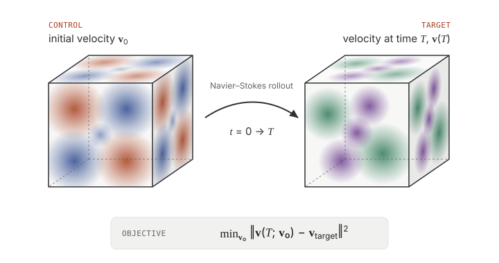

::: {.page-meta}
[F3]{.domain-id .d-F3} [Auto-generated 2026-10-08 14:11 UTC]{.meta-chip} [9 plots]{.meta-chip}
:::

::: {.domain-hero}
{.domain-figure}

[Recover the initial velocity field of a 3D turbulent flow from a later snapshot, differentiating through the Navier–Stokes rollout.]{.domain-tagline}

:::

**Fluid flow in 3D.** The 3D counterpart of the 2D fluid problem, and the harder stress test for differentiable simulation: real turbulence lives in 3D, and the gradients are correspondingly more delicate.

We solve the 3D incompressible Navier–Stokes equations $\partial_t \mathbf{u} + (\mathbf{u}\cdot\nabla)\mathbf{u} = -\nabla p + \nu\,\nabla^2\mathbf{u}$, $\nabla\cdot\mathbf{u}=0$, with viscosity $\nu$ as the primary control parameter. Unlike 2D, the 3D equations admit *vortex stretching*, which amplifies vorticity and brings on chaos far sooner: the chaos horizon is $T^\ast \approx 8\text{–}16$ s versus $T^\ast > 64$ s in 2D (at $\nu=10^{-3}$, $N=16$). As a result gradient norms *grow* along the rollout here rather than decaying as they do in 2D.

::: {.callout-tip title='How these results were produced' collapse='true'}

These are **example results**, produced automatically on GitHub Actions runners and refreshed on every release. Each solver runs on its intended device: GPU-capable solvers on a Tesla T4 GPU node, CPU-only solvers (OpenFOAM, deal.II, FEniCS, Firedrake) on a CPU node. Accuracy and gradient metrics are hardware-independent and reproducible. Wall-clock numbers reflect commodity cloud hardware and can vary by 10–15% between runs, so read them for relative scaling between solvers rather than as absolute timings. For numbers that reflect *your* setup, [run the benchmarks yourself](getting-started.qmd) on your target hardware.

:::

::: {.callout-note title='Boundary conditions'}

Triply-periodic cubic domain $[0, 2\pi]^3$ (the flow wraps around on all three axes). Incompressibility $\nabla\cdot\mathbf{u}=0$ is enforced by a pressure projection at each time step. No walls or inflow/outflow boundaries.

:::

## Scores at a glance {.unnumbered}

```{=html}
<div class="scoreboard scoreboard-domain"><div class="table-scroll"><table class="sb-table"><thead><tr><th class="sb-rank" scope="col">Rank</th><th scope="col" class="sb-solver">Solver</th><th scope="col">Forward</th><th scope="col">Gradient</th><th scope="col">Cost</th><th scope="col">Optimization</th><th scope="col">Reliability</th><th scope="col" class="sb-overall">Score</th></tr></thead><tbody><tr><td class="sb-rank"><span class="rank-pill r1">1</span></td><th scope="row" class="sb-solver"><a href="solvers.qmd#navier-stokes-grid-exponax">Exponax</a></th><td class="sb-cell lvl-5"><span class="sb-val">87</span></td><td class="sb-cell lvl-3"><span class="sb-val">56</span></td><td class="sb-cell lvl-5"><span class="sb-val">90</span></td><td class="sb-cell lvl-4"><span class="sb-val">65</span></td><td class="sb-cell lvl-5"><span class="sb-val">100</span></td><td class="sb-overall"><div class="sb-bar"><span style="width:79.4%"></span></div><span class="sb-val">79</span></td></tr><tr><td class="sb-rank"><span class="rank-pill r2">2</span></td><th scope="row" class="sb-solver"><a href="solvers.qmd#navier-stokes-grid-warp-ns">Warp-NS</a></th><td class="sb-cell lvl-3"><span class="sb-val">41</span></td><td class="sb-cell lvl-5"><span class="sb-val">81</span></td><td class="sb-cell lvl-5"><span class="sb-val">95</span></td><td class="sb-cell lvl-4"><span class="sb-val">73</span></td><td class="sb-cell lvl-5"><span class="sb-val">94</span></td><td class="sb-overall"><div class="sb-bar"><span style="width:76.9%"></span></div><span class="sb-val">77</span></td></tr><tr><td class="sb-rank"><span class="rank-pill r3">3</span></td><th scope="row" class="sb-solver"><a href="solvers.qmd#navier-stokes-grid-pict">PICT</a></th><td class="sb-cell lvl-2"><span class="sb-val">35</span></td><td class="sb-cell lvl-4"><span class="sb-val">68</span></td><td class="sb-cell lvl-4"><span class="sb-val">75</span></td><td class="sb-cell lvl-5"><span class="sb-val">100</span></td><td class="sb-cell lvl-5"><span class="sb-val">94</span></td><td class="sb-overall"><div class="sb-bar"><span style="width:74.4%"></span></div><span class="sb-val">74</span></td></tr><tr><td class="sb-rank"><span class="rank-pill r4">4</span></td><th scope="row" class="sb-solver"><a href="solvers.qmd#navier-stokes-grid-ins-jl">INS.jl</a></th><td class="sb-cell lvl-2"><span class="sb-val">23</span></td><td class="sb-cell lvl-3"><span class="sb-val">44</span></td><td class="sb-cell lvl-4"><span class="sb-val">62</span></td><td class="sb-cell lvl-5"><span class="sb-val">91</span></td><td class="sb-cell lvl-5"><span class="sb-val">94</span></td><td class="sb-overall"><div class="sb-bar"><span style="width:62.8%"></span></div><span class="sb-val">63</span></td></tr><tr><td class="sb-rank"><span class="rank-pill r4">5</span></td><th scope="row" class="sb-solver"><a href="solvers.qmd#navier-stokes-grid-phiflow">PhiFlow</a></th><td class="sb-cell lvl-2"><span class="sb-val">23</span></td><td class="sb-cell lvl-4"><span class="sb-val">76</span></td><td class="sb-cell lvl-2"><span class="sb-val">32</span></td><td class="sb-cell lvl-5"><span class="sb-val">89</span></td><td class="sb-cell lvl-4"><span class="sb-val">66</span></td><td class="sb-overall"><div class="sb-bar"><span style="width:57.4%"></span></div><span class="sb-val">57</span></td></tr><tr><td class="sb-rank"><span class="rank-pill r4">6</span></td><th scope="row" class="sb-solver"><a href="solvers.qmd#navier-stokes-grid-xlb">XLB</a></th><td class="sb-cell lvl-2"><span class="sb-val">23</span></td><td class="sb-cell lvl-4"><span class="sb-val">74</span></td><td class="sb-cell lvl-2"><span class="sb-val">29</span></td><td class="sb-cell lvl-3"><span class="sb-val">46</span></td><td class="sb-cell lvl-5"><span class="sb-val">91</span></td><td class="sb-overall"><div class="sb-bar"><span style="width:52.6%"></span></div><span class="sb-val">53</span></td></tr><tr><td class="sb-rank"><span class="rank-pill r4">7</span></td><th scope="row" class="sb-solver"><a href="solvers.qmd#navier-stokes-grid-openfoam">OpenFOAM</a></th><td class="sb-cell lvl-2"><span class="sb-val">28</span></td><td class="sb-cell lvl-0"><span class="sb-val">—</span></td><td class="sb-cell lvl-3"><span class="sb-val">47</span></td><td class="sb-cell lvl-0"><span class="sb-val">—</span></td><td class="sb-cell lvl-5"><span class="sb-val">100</span></td><td class="sb-overall"><div class="sb-bar"><span style="width:35.0%"></span></div><span class="sb-val">35</span></td></tr></tbody></table></div></div>
```

*Per-axis scores from 0 to 100, computed from the same results as the rankings below. See the [Results overview](results.qmd#scoreboard) for the scoring method and the per-domain rankings.*

## Initial Conditions {#suite-ics .suite-heading data-suite="ics"}

::: {.suite-intro}
Visualisation of each initial condition (the starting field a run is launched from) available for this problem. IC plots are generated without running any solver.
:::

::: {.exp-card}


::: {.callout-note collapse='true' title='Settings'}

**Abc**

```json
{
  "N": 32
}
```

**Rand Div Free**

```json
{
  "N": 32
}
```

**Tgv3D**

```json
{
  "N": 32
}
```

:::

```{=html}
<figure class="m-chart" data-spec="../mosaic-results/ns-3d-grid/ics/ics.vl.json"></figure>
```

:::

## Forward {#suite-forward .suite-heading data-suite="forward"}

::: {.suite-intro}
**Is the prediction right?** Forward-pass benchmarks check each solver's output against a trusted reference (and an analytic solution where one exists): inter-solver agreement, field-level diagnostics, and long-run stability.
:::

::: {.exp-card}

### Agreement {#exp-forward-agreement}

3D velocity magnitude fields and kinetic energy spectra per solver, swept over viscosity ν, compared against a converged spectral reference. (The 3D TGV initial condition is not advection-free, so the linearized analytic decay is only a short-horizon consistency check, not an accuracy reference.)


::: {.callout-note collapse='true' title='Settings'}

Sweeps `nu` ∈ {0.001, 0.01, 0.05}

```json
{
  "ic": {
    "name": "tgv3d",
    "seed": 0
  },
  "physics": {
    "N": 16,
    "nu": 0.001,
    "dt": 0.01,
    "steps": 50,
    "lbm_N_base": 16
  },
  "sweep": {
    "key": "nu",
    "values": [
      0.001,
      0.01,
      0.05
    ]
  }
}
```

:::

```{=html}
<figure class="m-chart" data-spec="../mosaic-results/ns-3d-grid/forward/agreement/agreement.vl.json"></figure>
```

:::

::: {.exp-card}

### Baseline {#exp-forward-baseline}

Relative error vs grid resolution N at steps=1; validates single-step forward accuracy across 3D solvers.


::: {.callout-note collapse='true' title='Settings'}

Sweeps `N` ∈ {8, 16, 32}

```json
{
  "ic": {
    "name": "tgv3d",
    "seed": 0
  },
  "physics": {
    "N": 8,
    "nu": 0.05,
    "dt": 0.01,
    "steps": 1
  },
  "sweep": {
    "key": "N",
    "values": [
      8,
      16,
      32
    ]
  }
}
```

:::

```{=html}
<figure class="m-chart" data-spec="../mosaic-results/ns-3d-grid/forward/baseline/agreement.vl.json"></figure>
```

:::

[Solver ranking]{.eyebrow}

::: {.sortable-table .leaderboard}
| Solver | Mean rel. error |
|---|---|
| Exponax | 6.27e-06 |
| Warp-NS | 3.41e-03 |
| PICT | 7.96e-03 |
| OpenFOAM | 2.10e-02 |
| PhiFlow | 3.97e-02 |
| INS.jl | 4.14e-02 |
| XLB | 4.35e-02 |
:::

*Ranked by mean relative error against the reference solution (lower is more accurate).*

## Cost {#suite-cost .suite-heading data-suite="cost"}

::: {.suite-intro}
**What does it cost?** Wall-clock scaling of the forward and VJP passes with problem size $N$ and the number of integration steps. Timings come from dedicated runners with no concurrent workloads; see the reliability note at the top of the page before reading absolute numbers.
:::

::: {.exp-card}


::: {.callout-note collapse='true' title='Settings'}

**Spatial Cost**

Sweeps `N` ∈ {16, 32, 48, 64}

```json
{
  "physics": {
    "nu": 0.01,
    "dt": 0.01,
    "lbm_N_base": 16,
    "steps": 50,
    "N": 16
  },
  "cost": {
    "n_trials": 3
  },
  "sweep": {
    "key": "N",
    "values": [
      16,
      32,
      48,
      64
    ]
  }
}
```

**Temporal Cost**

Sweeps `steps` ∈ {10, 50, 100}

```json
{
  "physics": {
    "nu": 0.01,
    "dt": 0.01,
    "lbm_N_base": 16,
    "N": 48,
    "steps": 10
  },
  "cost": {
    "n_trials": 3
  },
  "sweep": {
    "key": "steps",
    "values": [
      10,
      50,
      100
    ]
  }
}
```

:::

```{=html}
<figure class="m-chart" data-spec="../mosaic-results/ns-3d-grid/cost/cost.vl.json"></figure>
```

:::

[Solver ranking]{.eyebrow}

::: {.sortable-table .leaderboard}
| Solver | Forward time | VJP time |
|---|---|---|
| Warp-NS | 0.138 s @ N=64 | 0.594 s @ N=64 |
| PICT | 1.13 s @ N=64 | 4.16 s @ N=64 |
| Exponax | 1.55 s @ N=64 | 6.09 s @ N=64 |
| PhiFlow | 3.4 s @ N=32 | 10.4 s @ N=32 |
| INS.jl | 4.33 s @ N=64 | 68.9 s @ N=64 |
| OpenFOAM | 28.2 s @ N=64 | — |
| XLB | 181 s @ N=64 | 565 s @ N=48 |
:::

*Forward and VJP (backward) wall-clock time, each shown at the largest problem size N the solver completed for that pass; ranked by forward time (faster is better). Forward-only solvers have no VJP entry. See the reliability note above before comparing across devices.*

## Gradient {#suite-gradient .suite-heading data-suite="gradient"}

::: {.suite-intro}
**Is the gradient right?** Gradient benchmarks compare each solver's AD/adjoint gradient against a finite-difference ground truth. We report magnitude error (relative $L^2$) and direction agreement (cosine similarity) across parameter, resolution, and horizon sweeps. The horizon sweep in particular exposes how gradients degrade as the rollout lengthens.
:::

::: {.exp-card}


::: {.callout-note collapse='true' title='Settings'}

**Fd Check**

```json
{
  "ic": {
    "name": "tgv3d",
    "seed": 0
  },
  "physics": {
    "N": 16,
    "nu": 0.001,
    "dt": 0.05,
    "steps": 10
  },
  "fd": {
    "eps_values": [
      5.0,
      1.0,
      0.1,
      0.01,
      0.001,
      0.0001
    ],
    "n_dirs": 10
  }
}
```

**Horizon Sweep Limits**

Sweeps `steps` ∈ {40, 80, 160, 320, 640, 1280, 2560, 5120, 10240}

```json
{
  "ic": {
    "name": "tgv3d",
    "seed": 0
  },
  "physics": {
    "N": 20,
    "nu": 0.001,
    "dt": 0.05,
    "steps": 40
  },
  "sweep": {
    "key": "steps",
    "values": [
      40,
      80,
      160,
      320,
      640,
      1280,
      2560,
      5120,
      10240
    ]
  }
}
```

**Jacobian Svd**

```json
{
  "ic": {
    "name": "tgv3d",
    "seed": 0
  },
  "physics": {
    "N": 8,
    "nu": 0.001,
    "dt": 0.05,
    "steps": 10
  },
  "jacobian": {
    "n_alphas": 41,
    "alpha_range": 0.3
  }
}
```

**Jacobian Svd Nu01**

```json
{
  "ic": {
    "name": "tgv3d",
    "seed": 0
  },
  "physics": {
    "N": 8,
    "nu": 0.01,
    "dt": 0.05,
    "steps": 10
  },
  "jacobian": {
    "n_alphas": 41,
    "alpha_range": 0.3
  }
}
```

**Jacobian Svd Steps20**

```json
{
  "ic": {
    "name": "tgv3d",
    "seed": 0
  },
  "physics": {
    "N": 8,
    "nu": 0.001,
    "dt": 0.05,
    "steps": 20
  },
  "jacobian": {
    "n_alphas": 41,
    "alpha_range": 0.3
  }
}
```

**Jacobian Svd Steps40**

```json
{
  "ic": {
    "name": "tgv3d",
    "seed": 0
  },
  "physics": {
    "N": 8,
    "nu": 0.001,
    "dt": 0.05,
    "steps": 40
  },
  "jacobian": {
    "n_alphas": 41,
    "alpha_range": 0.3
  }
}
```

:::

```{=html}
<figure class="m-chart" data-spec="../mosaic-results/ns-3d-grid/gradient/jacobian_svd_comparison.vl.json"></figure>
```

:::

::: {.exp-card}

### Finite-Difference Check {#exp-gradient-fd-check}

Finite-difference gradient error U-curves and direction cosine vs perturbation ε for each solver on the 3D Taylor-Green vortex IC.


::: {.callout-note collapse='true' title='Settings'}

```json
{
  "ic": {
    "name": "tgv3d",
    "seed": 0
  },
  "physics": {
    "N": 16,
    "nu": 0.001,
    "dt": 0.05,
    "steps": 10
  },
  "fd": {
    "eps_values": [
      5.0,
      1.0,
      0.1,
      0.01,
      0.001,
      0.0001
    ],
    "n_dirs": 10
  }
}
```

:::

```{=html}
<figure class="m-chart" data-spec="../mosaic-results/ns-3d-grid/gradient/fd_check/fd_check.vl.json"></figure>
```
```{=html}
<figure class="m-chart" data-spec="../mosaic-results/ns-3d-grid/gradient/fd_check/gradient_fields.vl.json"></figure>
```

:::

::: {.exp-card}

### Horizon Sweep Limits {#exp-gradient-horizon-sweep-limits}

Per-solver rollout-limit table reporting step count at first failure, failure type, and wall time per successful step.


::: {.callout-note collapse='true' title='Settings'}

Sweeps `steps` ∈ {40, 80, 160, 320, 640, 1280, 2560, 5120, 10240}

```json
{
  "ic": {
    "name": "tgv3d",
    "seed": 0
  },
  "physics": {
    "N": 20,
    "nu": 0.001,
    "dt": 0.05,
    "steps": 40
  },
  "sweep": {
    "key": "steps",
    "values": [
      40,
      80,
      160,
      320,
      640,
      1280,
      2560,
      5120,
      10240
    ]
  }
}
```

:::

```{=html}
<figure class="m-chart" data-spec="../mosaic-results/ns-3d-grid/gradient/horizon_sweep_limits/horizon_sweep_limits.vl.json"></figure>
```

:::

[Solver ranking]{.eyebrow}

::: {.sortable-table .leaderboard}
| Solver | Best-ε FD error | 1 − cosine |
|---|---|---|
| Warp-NS | 1.30e-05 | 1.53e-10 |
| PhiFlow | 2.62e-05 | 2.81e-10 |
| XLB | 3.71e-05 | 1.23e-09 |
| PICT | 8.37e-05 | 7.91e-09 |
| Exponax | 4.66e-04 | 9.68e-08 |
| INS.jl | 2.36e-03 | 4.69e-06 |
:::

*Ranked by the best-ε finite-difference error of the gradient (lower is more trustworthy); direction cosine near 1 confirms the gradient points the right way.*

## Optimization {#suite-optimization .suite-heading data-suite="optimization"}

::: {.suite-intro}
**Can you optimize through it?** End-to-end optimization benchmarks run a gradient-based optimizer using each solver's own gradients: recovery of initial conditions or physical parameters, topology optimization, and drag minimization. This is the ultimate test, since a gradient can pass the finite-difference check yet still fail to drive a full optimization loop.
:::

::: {.exp-card}

### Initial-Condition Recovery (L-BFGS) {#exp-optimization-recovery-constant-ic-bfgs-proj}

Final IC recovery error per solver from zero-initialised L-BFGS optimisation with divergence-free projection.


::: {.callout-note collapse='true' title='Settings'}

Sweeps `steps` ∈ {100}

```json
{
  "ic": {
    "name": "rand_div_free",
    "seed": 0
  },
  "physics": {
    "N": 16,
    "nu": 0.01,
    "dt": 0.02,
    "steps": 100
  },
  "optim": {
    "ic_init_type": "zeros",
    "max_iters": 100,
    "patience": 20,
    "failure_threshold": 2.0,
    "snap_interval": 5,
    "ic_seeds": [
      0,
      1,
      2
    ],
    "record_diagnostics": true
  },
  "sweep": {
    "key": "steps",
    "values": [
      100
    ]
  },
  "optimizer": "bfgs_proj",
  "_exp_key": "recovery_constant_ic_bfgs_proj"
}
```

:::

{.lightbox}

:::

[Solver ranking]{.eyebrow}

::: {.sortable-table .leaderboard}
| Solver | Final IC recovery error | Converged |
|---|---|---|
| PICT | 1.55e-03 | yes |
| INS.jl | 2.75e-03 | yes |
| PhiFlow | 3.17e-03 | yes |
| Warp-NS | 8.78e-03 | yes |
| Exponax | 1.49e-02 | yes |
| XLB | 5.01e-02 | yes |
:::

*Ranked by the final objective reached within the iteration budget (lower is better).*
