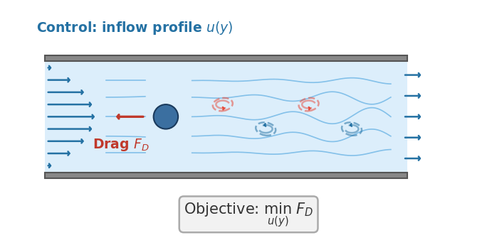

> Auto-generated 2026-06-15 19:21 UTC &nbsp;·&nbsp; 12 plots

{width=100% style="max-width:560px; display:block; margin:0 auto 0.5rem;"}

*Optimize the inflow of a 2D channel flow to minimize drag on a cylinder, differentiating through an incompressible fluid solver.*

**Fluid flow in 2D.** We simulate an incompressible fluid (think of stirred water) and differentiate through the simulation. The headline question is whether each solver returns a trustworthy gradient as the flow becomes chaotic.

Formally, we solve the 2D incompressible Navier–Stokes equations $\partial_t \mathbf{u} + (\mathbf{u}\cdot\nabla)\mathbf{u} = -\nabla p + \nu\,\nabla^2\mathbf{u}$, $\nabla\cdot\mathbf{u}=0$, with the kinematic viscosity $\nu$ as the primary control parameter. The nonlinear advection term $\nabla\cdot(\mathbf{u}\otimes\mathbf{u})$ transfers energy across scales; at low $\nu$ the flow develops turbulent cascades and a positive Lyapunov exponent, so long-horizon gradients grow exponentially sensitive to perturbations. This is the regime where backprop-through-simulation is hardest.

::: {.callout-tip title='How these results were produced' collapse='true'}

These are **example results**, produced automatically on GitHub Actions runners and refreshed on every release. Each solver runs on its intended device: GPU-capable solvers on a Tesla T4 GPU node, CPU-only solvers (OpenFOAM, deal.II, FEniCS, Firedrake) on a CPU node. Accuracy and gradient metrics are hardware-independent and reproducible. Wall-clock numbers reflect commodity cloud hardware and can vary by 10–15% between runs, so read them for relative scaling between solvers rather than as absolute timings. For numbers that reflect *your* setup, [run the benchmarks yourself](getting-started.qmd) on your target hardware.

:::

::: {.callout-note title='Boundary conditions'}

Doubly-periodic square domain $[0, 2\pi]^2$ (the flow wraps around at every edge). Incompressibility $\nabla\cdot\mathbf{u}=0$ is enforced by a pressure projection at each time step. No walls or inflow/outflow boundaries.

:::

## Initial Conditions

Visualisation of each initial condition (the starting field a run is launched from) available for this problem. IC plots are generated without running any solver.


::: {.callout-note collapse='true' title='Settings'}

**Flat Inflow**

```json
{
  "N": 64,
  "U": 0.5
}
```

**Multimode**

```json
{
  "N": 64
}
```

**Tgv**

```json
{
  "N": 64
}
```

**Uniform**

```json
{
  "N": 64,
  "U": 1.0
}
```

:::

{.lightbox}

## Forward

**Is the prediction right?** Forward-pass benchmarks check each solver's output against a trusted reference (and an analytic solution where one exists): inter-solver agreement, field-level diagnostics, and long-run stability.

### Baseline

Relative error vs grid resolution $N$ at steps=1; validates single-step forward accuracy across solvers.


::: {.callout-note collapse='true' title='Settings'}

Sweeps `N` ∈ {16, 32, 64, 128}

```json
{
  "ic": {
    "name": "tgv",
    "seed": 0
  },
  "physics": {
    "N": 16,
    "nu": 0.05,
    "dt": 0.01,
    "steps": 1,
    "lbm_N_base": 64
  },
  "sweep": {
    "key": "N",
    "values": [
      16,
      32,
      64,
      128
    ]
  }
}
```

:::

{.lightbox}

### Cylinder

Vorticity snapshots and kinetic-energy evolution vs time for each solver across a sweep of viscosities.


::: {.callout-note collapse='true' title='Settings'}

Sweeps `nu` ∈ {0.05, 0.02, 0.01, 0.005}

```json
{
  "ic": {
    "name": "uniform",
    "seed": 0
  },
  "physics": {
    "N": 64,
    "dt": 0.01,
    "steps": 500,
    "obstacle": {
      "shape": "cylinder",
      "center": [
        0.5,
        0.5
      ],
      "radius": 0.1
    },
    "nu": 0.05
  },
  "reference_solver": "openfoam",
  "sweep": {
    "key": "nu",
    "values": [
      0.05,
      0.02,
      0.01,
      0.005
    ]
  }
}
```

:::

{.lightbox}

### Tgv Nu Sweep

Relative error vs viscosity $\nu$ for each solver at a fixed TGV initial condition.


::: {.callout-note collapse='true' title='Settings'}

Sweeps `nu` ∈ {0.0001, 0.0005, 0.001, 0.005, 0.01, 0.05}

```json
{
  "ic": {
    "name": "tgv",
    "seed": 42
  },
  "physics": {
    "N": 64,
    "dt": 0.05,
    "steps": 20,
    "nu": 0.0001
  },
  "sweep": {
    "key": "nu",
    "values": [
      0.0001,
      0.0005,
      0.001,
      0.005,
      0.01,
      0.05
    ]
  }
}
```

:::

{.lightbox}

**Solver ranking**

::: {.sortable-table}
| Solver | Mean rel. error |
|---|---|
| Warp-NS | 6.20e-04 |
| INS.jl | 2.39e-03 |
| PhiFlow | 2.43e-03 |
| PICT | 3.52e-03 |
| OpenFOAM | 3.88e-03 |
| jax-cfd | 1.41e-02 |
| XLB | 2.63e-01 |
:::

*Ranked by mean relative error against the reference solution (lower is more accurate).*

## Cost

**What does it cost?** Wall-clock scaling of the forward and VJP passes with problem size $N$ and the number of integration steps. Timings come from dedicated runners with no concurrent workloads; see the reliability note at the top of the page before reading absolute numbers.


::: {.callout-note collapse='true' title='Settings'}

**Spatial Cost**

Sweeps `N` ∈ {64, 128, 192, 256}

```json
{
  "physics": {
    "nu": 0.01,
    "dt": 0.01,
    "steps": 100,
    "N": 64
  },
  "cost": {
    "n_trials": 3
  },
  "sweep": {
    "key": "N",
    "values": [
      64,
      128,
      192,
      256
    ]
  }
}
```

**Temporal Cost**

Sweeps `steps` ∈ {10, 50, 100, 500, 1000}

```json
{
  "physics": {
    "nu": 0.01,
    "dt": 0.01,
    "N": 128,
    "steps": 10
  },
  "cost": {
    "n_trials": 3
  },
  "sweep": {
    "key": "steps",
    "values": [
      10,
      50,
      100,
      500,
      1000
    ]
  }
}
```

:::

{.lightbox}

**Solver ranking**

::: {.sortable-table}
| Solver | Forward time | VJP time |
|---|---|---|
| jax-cfd | 0.113 s @ N=256 | 18.1 s @ N=256 |
| XLB | 0.169 s @ N=256 | 5.93 s @ N=256 |
| Warp-NS | 0.609 s @ N=256 | 2.01 s @ N=256 |
| PICT | 2.36 s @ N=256 | 7.53 s @ N=256 |
| INS.jl | 2.87 s @ N=256 | 15.9 s @ N=256 |
| OpenFOAM | 35.2 s @ N=256 | — |
| PhiFlow | 41.7 s @ N=192 | 125 s @ N=192 |
:::

*Forward and VJP (backward) wall-clock time, each shown at the largest problem size N the solver completed for that pass; ranked by forward time (faster is better). Forward-only solvers have no VJP entry. See the reliability note above before comparing across devices.*

## Gradient

**Is the gradient right?** Gradient benchmarks compare each solver's AD/adjoint gradient against a finite-difference ground truth. We report magnitude error (relative $L^2$) and direction agreement (cosine similarity) across parameter, resolution, and horizon sweeps. The horizon sweep in particular exposes how gradients degrade as the rollout lengthens.

### Finite-Difference Check

U-curves of finite-difference gradient error vs perturbation size $\varepsilon$ together with subspace cosine; validates VJP correctness.


::: {.callout-note collapse='true' title='Settings'}

```json
{
  "ic": {
    "name": "multimode",
    "seed": 42
  },
  "physics": {
    "N": 16,
    "nu": 0.001,
    "dt": 0.05,
    "steps": 20
  },
  "fd": {
    "eps_values": [
      5.0,
      1.0,
      0.1,
      0.01,
      0.001,
      0.0001
    ],
    "n_dirs": 20
  }
}
```

:::

{.lightbox}
{.lightbox}

### Parameter Sweep

Gradient norm, best-$\varepsilon$ FD error, direction cosine, and U-curves vs the sweep parameter.


::: {.callout-note collapse='true' title='Settings'}

Sweeps `nu` ∈ {0.05, 0.01, 0.005, 0.001}

```json
{
  "ic": {
    "name": "multimode",
    "seed": 42
  },
  "physics": {
    "N": 16,
    "dt": 0.05,
    "steps": 200,
    "nu": 0.05
  },
  "fd": {
    "eps_values": [
      5.0,
      1.0,
      0.1,
      0.01,
      0.001
    ],
    "n_dirs": 15
  },
  "sweep": {
    "key": "nu",
    "values": [
      0.05,
      0.01,
      0.005,
      0.001
    ]
  }
}
```

:::

{.lightbox}

### Horizon Sweep

Gradient norm, FD error, and direction cosine vs rollout horizon $T = \mathrm{steps}\cdot dt$.


::: {.callout-note collapse='true' title='Settings'}

Sweeps `steps` ∈ {5, 10, 20, 40, 80, 160, 320}

```json
{
  "ic": {
    "name": "multimode",
    "seed": 42
  },
  "physics": {
    "N": 16,
    "nu": 0.001,
    "dt": 0.05,
    "steps": 5
  },
  "fd": {
    "eps_values": [
      1.0,
      0.1,
      0.01,
      0.001
    ],
    "n_dirs": 8
  },
  "sweep": {
    "key": "steps",
    "values": [
      5,
      10,
      20,
      40,
      80,
      160,
      320
    ]
  }
}
```

:::

{.lightbox}

**Solver ranking**

::: {.sortable-table}
| Solver | Best-ε FD error | 1 − cosine |
|---|---|---|
| PhiFlow | 7.07e-06 | 1.08e-10 |
| INS.jl | 7.57e-06 | 3.33e-11 |
| Warp-NS | 4.39e-05 | 1.27e-09 |
| XLB | 8.60e-05 | 8.87e-09 |
| jax-cfd | 5.46e-04 | 1.84e-07 |
| PICT | 8.84e-04 | 5.62e-07 |
:::

*Ranked by the best-ε finite-difference error of the gradient (lower is more trustworthy); direction cosine near 1 confirms the gradient points the right way.*

## Optimization

**Can you optimize through it?** End-to-end optimization benchmarks run a gradient-based optimizer using each solver's own gradients: recovery of initial conditions or physical parameters, topology optimization, and drag minimization. This is the ultimate test, since a gradient can pass the finite-difference check yet still fail to drive a full optimization loop.

### Drag Opt

Drag convergence curves per solver, optimised vs initial inflow profiles, and final drag coefficient comparison.


::: {.callout-note collapse='true' title='Settings'}

```json
{
  "ic": {
    "name": "flat_inflow",
    "seed": 0
  },
  "physics": {
    "N": 32,
    "nu": 0.0025,
    "dt": 0.02,
    "steps": 200,
    "domain_extent": 1.0,
    "U_mean": 0.5,
    "obstacle": {
      "shape": "cylinder",
      "center": [
        0.5,
        0.5
      ],
      "radius": 0.05
    }
  },
  "optim": {
    "lr": 0.0005,
    "max_iters": 250,
    "patience": 50,
    "flow_penalty_weight": 50.0,
    "snap_interval": 20
  }
}
```

:::

{.lightbox}
{.lightbox}
{.lightbox}

**Solver ranking**

::: {.sortable-table}
| Solver | Final drag | Converged |
|---|---|---|
| XLB | -4.78e-02 | no |
| PICT | -1.77e-02 | no |
| PhiFlow | -7.09e-04 | no |
:::

*Ranked by the final objective reached within the iteration budget (lower is better).*
