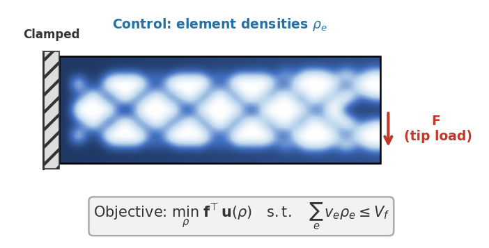

> Auto-generated 2026-06-15 19:21 UTC &nbsp;·&nbsp; 13 plots

{width=100% style="max-width:560px; display:block; margin:0 auto 0.5rem;"}

*Place a fixed budget of material in a clamped beam to make it as stiff as possible, differentiating through a finite-element solve.*

**Designing a stiff structure.** Given a fixed amount of material, where should it go to make a loaded beam as rigid as possible? This is *topology optimization*, solved by differentiating a finite-element stress analysis with respect to a per-element material density field $\rho$.

We minimize the compliance (inverse stiffness) of a 3D linear-elastic cantilever beam under the SIMP density-penalization scheme ($p=3$, $E_\max = 70{,}000$ MPa). Each element's stiffness follows the constitutive relation $E_\text{eff}(\rho) = E_\min + (E_\max - E_\min)\,\rho^3$, and the global stiffness matrix $K(\rho)$ couples every element to the displacement field. The objective $C = \mathbf{F}^\top K(\rho)^{-1}\mathbf{F}$ (external work under load $\mathbf{F}$) is smooth but non-convex in $\rho$, so gradient-based optimization drives the design toward sparse, near-binary $0/1$ material layouts, and the gradient must stay reliable throughout.

::: {.callout-tip title='How these results were produced' collapse='true'}

These are **example results**, produced automatically on GitHub Actions runners and refreshed on every release. Each solver runs on its intended device: GPU-capable solvers on a Tesla T4 GPU node, CPU-only solvers (OpenFOAM, deal.II, FEniCS, Firedrake) on a CPU node. Accuracy and gradient metrics are hardware-independent and reproducible. Wall-clock numbers reflect commodity cloud hardware and can vary by 10–15% between runs, so read them for relative scaling between solvers rather than as absolute timings. For numbers that reflect *your* setup, [run the benchmarks yourself](getting-started.qmd) on your target hardware.

:::

::: {.callout-note title='Boundary conditions'}

3D cantilever beam on domain $[0,2]\times[0,1]\times[0,1]$ (HEX8 elements, 2:1:1 aspect). Dirichlet: all nodes at $x=0$ have zero displacement (clamped wall). Neumann: a prescribed total force is applied to the right face ($x=2$), either a uniform downward traction or a concentrated upward corner load depending on the experiment (controlled by the corner_load flag).

:::

## Initial Conditions

Visualisation of each initial condition (the starting field a run is launched from) available for this problem. IC plots are generated without running any solver.


::: {.callout-note collapse='true' title='Settings'}

**Two Density Bumps**

```json
{
  "nx": 16,
  "ny": 2,
  "nz": 8
}
```

**Uniform**

```json
{
  "rho_0": 0.5,
  "nx": 16
}
```

:::

{.lightbox}

## Forward

**Is the prediction right?** Forward-pass benchmarks check each solver's output against a trusted reference (and an analytic solution where one exists): inter-solver agreement, field-level diagnostics, and long-run stability.

### Agreement

Structural compliance $C = \mathbf{F}^\top \mathbf{u}$ vs density $\rho_0$ at fixed mesh, sweeping uniform density to span the SIMP stiffness regime.


::: {.callout-note collapse='true' title='Settings'}

Sweeps `rho_0` ∈ {0.2, 0.4, 0.5, 0.7, 0.9}

```json
{
  "ic": {
    "name": "uniform",
    "seed": 0
  },
  "physics": {
    "nx": 8,
    "ny": 2,
    "nz": 4,
    "Lx": 2.0,
    "Ly": 1.0,
    "Lz": 1.0,
    "F_total": 1.0,
    "corner_load": false,
    "rho_0": 0.2
  },
  "sweep": {
    "key": "rho_0",
    "values": [
      0.2,
      0.4,
      0.5,
      0.7,
      0.9
    ]
  }
}
```

:::

{.lightbox}

### Baseline

Structural compliance $C = \mathbf{F}^\top \mathbf{u}$ vs mesh resolution $N$ for each solver, uniform density $\rho_0=0.5$, full-face downward load.


::: {.callout-note collapse='true' title='Settings'}

Sweeps `N` ∈ {4, 6, 8, 12, 16}

```json
{
  "ic": {
    "name": "uniform",
    "seed": 0
  },
  "physics": {
    "N": 4,
    "ny": 2,
    "nz": 4,
    "Lx": 2.0,
    "Ly": 1.0,
    "Lz": 1.0,
    "F_total": 1.0,
    "corner_load": false
  },
  "sweep": {
    "key": "N",
    "values": [
      4,
      6,
      8,
      12,
      16
    ]
  }
}
```

:::

{.lightbox}

### Physical Laws

Diagnostic functionals (compliance, total displacement) vs total load $F_\mathrm{total}$, validating linearity of the SIMP response.


::: {.callout-note collapse='true' title='Settings'}

Sweeps `F_total` ∈ {0.25, 0.5, 1.0, 2.0, 4.0}

```json
{
  "ic": {
    "name": "uniform",
    "seed": 0
  },
  "physics": {
    "nx": 8,
    "ny": 2,
    "nz": 4,
    "Lx": 2.0,
    "Ly": 1.0,
    "Lz": 1.0,
    "corner_load": false,
    "rho_0": 0.5,
    "F_total": 0.25
  },
  "sweep": {
    "key": "F_total",
    "values": [
      0.25,
      0.5,
      1.0,
      2.0,
      4.0
    ]
  },
  "diagnostics": {
    "compliance": "<callable _get_compliance>"
  }
}
```

:::

{.lightbox}

**Solver ranking**

::: {.sortable-table}
| Solver | Mean rel. error |
|---|---|
| deal.II | 0 |
| FEniCS | 0 |
| Firedrake | 0 |
| TopOpt.jl | 5.53e-03 |
:::

*Ranked by mean relative error against the reference solution (lower is more accurate).*

## Cost

**What does it cost?** Wall-clock scaling of the forward and VJP passes with problem size $N$ and the number of integration steps. Timings come from dedicated runners with no concurrent workloads; see the reliability note at the top of the page before reading absolute numbers.


::: {.callout-note collapse='true' title='Settings'}

**Spatial Cost**

Sweeps `nx` ∈ {4, 6, 8, 12, 16}

```json
{
  "physics": {
    "Lx": 2.0,
    "Ly": 1.0,
    "Lz": 1.0,
    "F_total": 1.0,
    "rho_0": 0.5,
    "corner_load": false,
    "steps": 1,
    "nx": 4
  },
  "cost": {
    "n_trials": 3
  },
  "sweep": {
    "key": "nx",
    "values": [
      4,
      6,
      8,
      12,
      16
    ]
  }
}
```

**Temporal Cost**

Sweeps `steps` ∈ {1}

```json
{
  "physics": {
    "Lx": 2.0,
    "Ly": 1.0,
    "Lz": 1.0,
    "F_total": 1.0,
    "rho_0": 0.5,
    "corner_load": false,
    "nx": 8,
    "steps": 1
  },
  "cost": {
    "n_trials": 3
  },
  "sweep": {
    "key": "steps",
    "values": [
      1
    ]
  }
}
```

:::

{.lightbox}

**Solver ranking**

::: {.sortable-table}
| Solver | Forward time | VJP time |
|---|---|---|
| TopOpt.jl | 0.0127 s @ N=16 | 0.0342 s @ N=16 |
| Firedrake | 0.103 s @ N=16 | 0.285 s @ N=16 |
| FEniCS | 0.138 s @ N=16 | 0.472 s @ N=16 |
| JAX-FEM | 0.154 s @ N=16 | 0.52 s @ N=16 |
| deal.II | 1.54 s @ N=16 | — |
:::

*Forward and VJP (backward) wall-clock time, each shown at the largest problem size N the solver completed for that pass; ranked by forward time (faster is better). Forward-only solvers have no VJP entry. See the reliability note above before comparing across devices.*

## Gradient

**Is the gradient right?** Gradient benchmarks compare each solver's AD/adjoint gradient against a finite-difference ground truth. We report magnitude error (relative $L^2$) and direction agreement (cosine similarity) across parameter, resolution, and horizon sweeps. The horizon sweep in particular exposes how gradients degrade as the rollout lengthens.

### Finite-Difference Check

U-curves of finite-difference gradient error vs perturbation size $\varepsilon$ with subspace cosine, validating VJP correctness on a random density.


::: {.callout-note collapse='true' title='Settings'}

```json
{
  "ic": {
    "name": "random",
    "seed": 0
  },
  "physics": {
    "nx": 8,
    "ny": 2,
    "nz": 4,
    "Lx": 2.0,
    "Ly": 1.0,
    "Lz": 1.0,
    "F_total": 1.0,
    "corner_load": true
  },
  "fd": {
    "eps_values": [
      2.0,
      0.5,
      0.1,
      0.03,
      0.01,
      0.003,
      0.001,
      0.0003,
      0.0001
    ],
    "n_dirs": 6
  }
}
```

:::

{.lightbox}

### Parameter Sweep

Gradient norm, best-$\varepsilon$ FD error, direction cosine, and U-curves vs uniform density $\rho_0$.


::: {.callout-note collapse='true' title='Settings'}

Sweeps `rho_0` ∈ {0.2, 0.4, 0.6, 0.8}

```json
{
  "ic": {
    "name": "uniform",
    "seed": 0
  },
  "physics": {
    "nx": 8,
    "ny": 2,
    "nz": 4,
    "Lx": 2.0,
    "Ly": 1.0,
    "Lz": 1.0,
    "F_total": 1.0,
    "corner_load": true,
    "rho_0": 0.2
  },
  "fd": {
    "eps_values": [
      0.5,
      0.1,
      0.03,
      0.01,
      0.003,
      0.001,
      0.0003
    ],
    "n_dirs": 6
  },
  "sweep": {
    "key": "rho_0",
    "values": [
      0.2,
      0.4,
      0.6,
      0.8
    ]
  }
}
```

:::

{.lightbox}

**Solver ranking**

::: {.sortable-table}
| Solver | Best-ε FD error | 1 − cosine |
|---|---|---|
| FEniCS | 2.10e-05 | 1.96e-10 |
| Firedrake | 2.10e-05 | 1.96e-10 |
| TopOpt.jl | 2.10e-05 | 1.96e-10 |
:::

*Ranked by the best-ε finite-difference error of the gradient (lower is more trustworthy); direction cosine near 1 confirms the gradient points the right way.*

## Optimization

**Can you optimize through it?** End-to-end optimization benchmarks run a gradient-based optimizer using each solver's own gradients: recovery of initial conditions or physical parameters, topology optimization, and drag minimization. This is the ultimate test, since a gradient can pass the finite-difference check yet still fail to drive a full optimization loop.

### Topology Optimisation

SIMP topology optimisation on a $16\times8\times8$ cantilever beam with Adam (lr=0.05): compliance $C = \mathbf{F}^\top \mathbf{u}$ and density field evolution under a 50% volume-fraction constraint.


::: {.callout-note collapse='true' title='Settings'}

```json
{
  "ic": {
    "name": "uniform",
    "seed": 0
  },
  "physics": {
    "nx": 16,
    "ny": 2,
    "nz": 8,
    "Lx": 2.0,
    "Ly": 1.0,
    "Lz": 1.0,
    "F_total": 1.0,
    "corner_load": true,
    "v_frac": 0.5,
    "compliance_key": "compliance",
    "penalty_weight": 50.0,
    "x_min": 0.001,
    "snap_interval": 5
  },
  "optim": {
    "lr": 0.05,
    "max_iters": 2500,
    "patience": 100
  }
}
```

:::

{.lightbox}
{.lightbox}
{.lightbox}
{.lightbox}
{.lightbox}
{.lightbox}

**Solver ranking**

::: {.sortable-table}
| Solver | Final compliance | Converged |
|---|---|---|
| JAX-FEM | 1.00e-03 | no |
| FEniCS | 1.00e-03 | no |
| Firedrake | 1.00e-03 | no |
| TopOpt.jl | 1.00e-03 | no |
:::

*Ranked by the final objective reached within the iteration budget (lower is better).*
