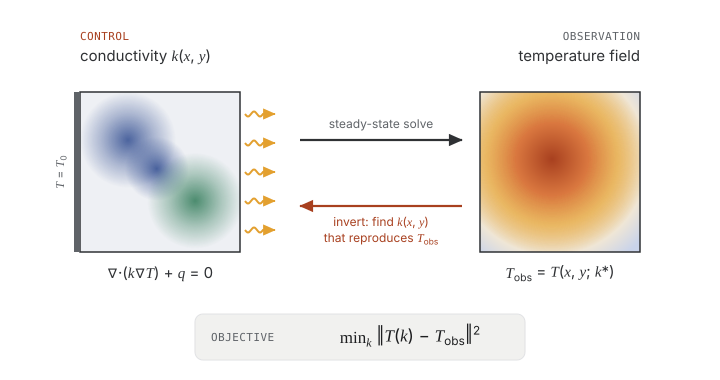

::: {.page-meta}
[H]{.domain-id .d-H} [Auto-generated 2026-10-08 12:01 UTC]{.meta-chip} [12 plots]{.meta-chip}
:::

::: {.domain-hero}
{.domain-figure}

[Invert for the conductivity field of a slab from its temperature, differentiating through a steady heat-conduction solve.]{.domain-tagline}

:::

**Routing heat through a material.** Where should the conductive material go to carry heat away most effectively? And, separately, can we recover an unknown heat source from temperature measurements? Both are inverse problems solved by differentiating through a steady heat-conduction solve.

We minimize the thermal compliance of a quasi-2D heated slab under the SIMP density-penalization scheme ($p=3$). The effective conductivity $k_\text{eff}(\rho) = k_\min + (k_\max - k_\min)\,\rho^3$ controls how heat is routed, and the compliance $C = \oint_\Gamma q_n\,T\,d\Gamma$ measures the work done by the heat flux on the temperature field. A hot-spot boundary condition (a central $1/3$ stripe) breaks $y$-symmetry and drives the topology optimization toward non-trivial branching structures. The same domain also hosts *source-identification* experiments, which recover an unknown volumetric heat source $f(\mathbf{x})$ from temperature observations by minimizing $\lVert T - T_\text{target} \rVert^2$.

::: {.callout-tip title='How these results were produced' collapse='true'}

These are **example results**, produced automatically on GitHub Actions runners and refreshed on every release. Each solver runs on its intended device: GPU-capable solvers on a Tesla T4 GPU node, CPU-only solvers (OpenFOAM, deal.II, FEniCS, Firedrake) on a CPU node. Accuracy and gradient metrics are hardware-independent and reproducible. Wall-clock numbers reflect commodity cloud hardware and can vary by 10–15% between runs, so read them for relative scaling between solvers rather than as absolute timings. For numbers that reflect *your* setup, [run the benchmarks yourself](getting-started.qmd) on your target hardware.

:::

::: {.callout-note title='Boundary conditions'}

Quasi-2D heated slab on domain $[0,2]\times[0,1]$ (a single HEX8 layer, $n_z=1$). The slab thickness $L_z$ scales with the in-plane element size ($L_z = L_x/n_x$) so the elements stay roughly cubic under refinement, keeping the linear system well-conditioned; $Q_\text{total}$ is thus a flux per unit slab depth. Dirichlet: all nodes at $x=0$ held at $T=0$ (fixed temperature). Neumann (uniform): uniform heat flux $Q_\text{total}$ over the right face ($x=2$). Neumann (hot-spot): flux concentrated on the central $1/3$ stripe in $y$ ($L_y/3 \le y \le 2L_y/3$) at the right face, driving non-trivial topology.

:::

## Scores at a glance {.unnumbered}

```{=html}
<div class="scoreboard scoreboard-domain"><div class="table-scroll"><table class="sb-table"><thead><tr><th class="sb-rank" scope="col">Rank</th><th scope="col" class="sb-solver">Solver</th><th scope="col">Forward</th><th scope="col">Gradient</th><th scope="col">Cost</th><th scope="col">Optimization</th><th scope="col">Reliability</th><th scope="col" class="sb-overall">Score</th></tr></thead><tbody><tr><td class="sb-rank"><span class="rank-pill r1">1</span></td><th scope="row" class="sb-solver"><a href="solvers.qmd#thermal-mesh-torch-fem-thermal">torch-fem</a></th><td class="sb-cell lvl-5"><span class="sb-val">100</span></td><td class="sb-cell lvl-4"><span class="sb-val">79</span></td><td class="sb-cell lvl-5"><span class="sb-val">97</span></td><td class="sb-cell lvl-5"><span class="sb-val">100</span></td><td class="sb-cell lvl-5"><span class="sb-val">100</span></td><td class="sb-overall"><div class="sb-bar"><span style="width:95.1%"></span></div><span class="sb-val">95</span></td></tr><tr><td class="sb-rank"><span class="rank-pill r2">2</span></td><th scope="row" class="sb-solver"><a href="solvers.qmd#thermal-mesh-fenics-heat">FEniCS</a></th><td class="sb-cell lvl-5"><span class="sb-val">100</span></td><td class="sb-cell lvl-4"><span class="sb-val">79</span></td><td class="sb-cell lvl-5"><span class="sb-val">91</span></td><td class="sb-cell lvl-5"><span class="sb-val">100</span></td><td class="sb-cell lvl-5"><span class="sb-val">100</span></td><td class="sb-overall"><div class="sb-bar"><span style="width:93.9%"></span></div><span class="sb-val">94</span></td></tr><tr><td class="sb-rank"><span class="rank-pill r3">3</span></td><th scope="row" class="sb-solver"><a href="solvers.qmd#thermal-mesh-jax-fem">JAX-FEM</a></th><td class="sb-cell lvl-5"><span class="sb-val">100</span></td><td class="sb-cell lvl-4"><span class="sb-val">79</span></td><td class="sb-cell lvl-4"><span class="sb-val">78</span></td><td class="sb-cell lvl-5"><span class="sb-val">100</span></td><td class="sb-cell lvl-5"><span class="sb-val">100</span></td><td class="sb-overall"><div class="sb-bar"><span style="width:91.4%"></span></div><span class="sb-val">91</span></td></tr><tr><td class="sb-rank"><span class="rank-pill r3">3</span></td><th scope="row" class="sb-solver"><a href="solvers.qmd#thermal-mesh-firedrake-heat">Firedrake</a></th><td class="sb-cell lvl-5"><span class="sb-val">100</span></td><td class="sb-cell lvl-4"><span class="sb-val">79</span></td><td class="sb-cell lvl-4"><span class="sb-val">74</span></td><td class="sb-cell lvl-5"><span class="sb-val">100</span></td><td class="sb-cell lvl-5"><span class="sb-val">100</span></td><td class="sb-overall"><div class="sb-bar"><span style="width:90.6%"></span></div><span class="sb-val">91</span></td></tr><tr><td class="sb-rank"><span class="rank-pill r4">5</span></td><th scope="row" class="sb-solver"><a href="solvers.qmd#thermal-mesh-dealii-heat">deal.II</a></th><td class="sb-cell lvl-5"><span class="sb-val">100</span></td><td class="sb-cell lvl-0"><span class="sb-val">—</span></td><td class="sb-cell lvl-4"><span class="sb-val">77</span></td><td class="sb-cell lvl-0"><span class="sb-val">—</span></td><td class="sb-cell lvl-5"><span class="sb-val">100</span></td><td class="sb-overall"><div class="sb-bar"><span style="width:55.5%"></span></div><span class="sb-val">55</span></td></tr></tbody></table></div></div>
```

*Per-axis scores from 0 to 100, computed from the same results as the rankings below. See the [Results overview](results.qmd#scoreboard) for the scoring method and the per-domain rankings.*

## Initial Conditions {#suite-ics .suite-heading data-suite="ics"}

::: {.suite-intro}
Visualisation of each initial condition (the starting field a run is launched from) available for this problem. IC plots are generated without running any solver.
:::

::: {.exp-card}


::: {.callout-note collapse='true' title='Settings'}

**Gaussian Source**

```json
{
  "nx": 16,
  "ny": 8,
  "nz": 1,
  "amplitude": 1.0,
  "cx": 0.5,
  "cy": 0.5,
  "sigma": 0.2
}
```

**Random**

```json
{
  "rho_0": 0.5,
  "noise": 0.3,
  "nx": 16,
  "ny": 8,
  "nz": 1,
  "seed": 0
}
```

**Two Gaussians**

```json
{
  "nx": 16,
  "ny": 8,
  "nz": 1
}
```

**Uniform**

```json
{
  "rho_0": 0.5,
  "nx": 16,
  "ny": 8,
  "nz": 1
}
```

**Zero Source**

```json
{
  "nx": 16,
  "ny": 8,
  "nz": 1
}
```

:::

{.lightbox}

:::

## Forward {#suite-forward .suite-heading data-suite="forward"}

::: {.suite-intro}
**Is the prediction right?** Forward-pass benchmarks check each solver's output against a trusted reference (and an analytic solution where one exists): inter-solver agreement, field-level diagnostics, and long-run stability.
:::

::: {.exp-card}

### Agreement {#exp-forward-agreement}

Thermal compliance $C$ vs uniform element density $\rho_0$ at fixed $N$; compares solvers on a log scale.


::: {.callout-note collapse='true' title='Settings'}

Sweeps `rho_0` ∈ {0.05, 0.1, 0.2, 0.4, 0.6, 0.8, 0.95}

```json
{
  "ic": {
    "name": "uniform",
    "seed": 0
  },
  "physics": {
    "nx": 16,
    "ny": 8,
    "nz": 1,
    "Lx": 2.0,
    "Ly": 1.0,
    "Q_total": 1.0,
    "rho_0": 0.05
  },
  "sweep": {
    "key": "rho_0",
    "values": [
      0.05,
      0.1,
      0.2,
      0.4,
      0.6,
      0.8,
      0.95
    ]
  }
}
```

:::

{.lightbox}

:::

::: {.exp-card}

### Baseline {#exp-forward-baseline}

Thermal compliance $C$ vs mesh resolution $N$ with random density; compares FV and FEM solvers across refinements.


::: {.callout-note collapse='true' title='Settings'}

Sweeps `N` ∈ {2, 3, 4, 6, 8, 12, 16, 24}

```json
{
  "ic": {
    "name": "random",
    "seed": 0
  },
  "physics": {
    "N": 2,
    "nz": 1,
    "Lx": 2.0,
    "Ly": 1.0,
    "Q_total": 1.0
  },
  "sweep": {
    "key": "N",
    "values": [
      2,
      3,
      4,
      6,
      8,
      12,
      16,
      24
    ]
  }
}
```

:::

{.lightbox}

:::

::: {.exp-card}

### Physical Laws {#exp-forward-physical-laws}

Thermal compliance $C$ vs total heat flux $Q_\mathrm{total}$ at fixed $N$ and $\rho_0$ with a hot-spot BC; shown on log-log axes.


::: {.callout-note collapse='true' title='Settings'}

Sweeps `Q_total` ∈ {0.25, 0.5, 1.0, 2.0, 4.0}

```json
{
  "ic": {
    "name": "uniform",
    "seed": 0
  },
  "physics": {
    "N": 16,
    "nz": 1,
    "Lx": 2.0,
    "Ly": 1.0,
    "rho_0": 0.5,
    "hot_spot": true,
    "Q_total": 0.25
  },
  "sweep": {
    "key": "Q_total",
    "values": [
      0.25,
      0.5,
      1.0,
      2.0,
      4.0
    ]
  },
  "diagnostics": {
    "thermal_compliance": "<callable _get_thermal_compliance>"
  }
}
```

:::

{.lightbox}

:::

::: {.exp-card}

### Source Baseline {#exp-forward-source-baseline}

Thermal compliance $C$ vs mesh resolution $N$ with a Gaussian source field; compares solvers across refinements.


::: {.callout-note collapse='true' title='Settings'}

Sweeps `N` ∈ {4, 6, 8, 12, 16, 24}

```json
{
  "ic": {
    "name": "gaussian_source"
  },
  "physics": {
    "N": 4,
    "nz": 1,
    "Lx": 2.0,
    "Ly": 1.0,
    "rho_0": 0.5,
    "ic_field": "source"
  },
  "sweep": {
    "key": "N",
    "values": [
      4,
      6,
      8,
      12,
      16,
      24
    ]
  }
}
```

:::

{.lightbox}

:::

::: {.exp-card}

### Source Linearity {#exp-forward-source-linearity}

Thermal compliance $C$ vs source amplitude at fixed mesh; compares solvers on log-log axes.


::: {.callout-note collapse='true' title='Settings'}

Sweeps `amplitude` ∈ {0.1, 0.25, 0.5, 1.0, 2.0, 4.0}

```json
{
  "ic": {
    "name": "gaussian_source"
  },
  "physics": {
    "nx": 16,
    "ny": 8,
    "nz": 1,
    "Lx": 2.0,
    "Ly": 1.0,
    "rho_0": 0.5,
    "ic_field": "source",
    "amplitude": 0.1
  },
  "sweep": {
    "key": "amplitude",
    "values": [
      0.1,
      0.25,
      0.5,
      1.0,
      2.0,
      4.0
    ]
  }
}
```

:::

{.lightbox}

:::

[Solver ranking]{.eyebrow}

::: {.sortable-table .leaderboard}
| Solver | Mean rel. error |
|---|---|
| deal.II | 1.74e-08 |
| FEniCS | 1.74e-08 |
| Firedrake | 1.74e-08 |
| JAX-FEM | 1.74e-08 |
| torch-fem | 1.74e-08 |
:::

*Ranked by mean relative error against the reference solution (lower is more accurate).*

## Cost {#suite-cost .suite-heading data-suite="cost"}

::: {.suite-intro}
**What does it cost?** Wall-clock scaling of the forward and VJP passes with problem size $N$ and the number of integration steps. Timings come from dedicated runners with no concurrent workloads; see the reliability note at the top of the page before reading absolute numbers.
:::

::: {.exp-card}


::: {.callout-note collapse='true' title='Settings'}

**Spatial Cost**

Sweeps `nx` ∈ {16, 32, 64, 128, 256, 512, 1024}

```json
{
  "physics": {
    "Lx": 2.0,
    "Ly": 1.0,
    "Q_total": 1.0,
    "rho_0": 0.5,
    "steps": 1,
    "nx": 16
  },
  "cost": {
    "n_trials": 3
  },
  "sweep": {
    "key": "nx",
    "values": [
      16,
      32,
      64,
      128,
      256,
      512,
      1024
    ]
  }
}
```

**Temporal Cost**

Sweeps `steps` ∈ {1}

```json
{
  "physics": {
    "Lx": 2.0,
    "Ly": 1.0,
    "Q_total": 1.0,
    "rho_0": 0.5,
    "nx": 64,
    "steps": 1
  },
  "cost": {
    "n_trials": 3
  },
  "sweep": {
    "key": "steps",
    "values": [
      1
    ]
  }
}
```

:::

{.lightbox}

:::

[Solver ranking]{.eyebrow}

::: {.sortable-table .leaderboard}
| Solver | Forward time | VJP time |
|---|---|---|
| torch-fem | 5.97 s @ N=1024 | 14.4 s @ N=1024 |
| FEniCS | 15.7 s @ N=1024 | 48.3 s @ N=1024 |
| deal.II | 52.2 s @ N=1024 | — |
| JAX-FEM | 76.2 s @ N=1024 | 227 s @ N=1024 |
| Firedrake | 88.6 s @ N=1024 | 187 s @ N=1024 |
:::

*Forward and VJP (backward) wall-clock time, each shown at the largest problem size N the solver completed for that pass; ranked by forward time (faster is better). Forward-only solvers have no VJP entry. See the reliability note above before comparing across devices.*

## Gradient {#suite-gradient .suite-heading data-suite="gradient"}

::: {.suite-intro}
**Is the gradient right?** Gradient benchmarks compare each solver's AD/adjoint gradient against a finite-difference ground truth. We report magnitude error (relative $L^2$) and direction agreement (cosine similarity) across parameter, resolution, and horizon sweeps. The horizon sweep in particular exposes how gradients degrade as the rollout lengthens.
:::

::: {.exp-card}

### Finite-Difference Check {#exp-gradient-fd-check}

FD gradient error vs step size $\varepsilon$ (U-curves), AD/FD direction cosine, and gradient magnitude field panels.


::: {.callout-note collapse='true' title='Settings'}

```json
{
  "ic": {
    "name": "random",
    "seed": 0
  },
  "physics": {
    "nx": 8,
    "ny": 4,
    "nz": 1,
    "Lx": 2.0,
    "Ly": 1.0,
    "Q_total": 1.0
  },
  "fd": {
    "eps_values": [
      1.0,
      0.1,
      0.01,
      0.001,
      0.0001
    ],
    "n_dirs": 6
  }
}
```

:::

{.lightbox}

:::

::: {.exp-card}

### Parameter Sweep {#exp-gradient-param-sweep}

Gradient norm, best-$\varepsilon$ FD error, AD/FD direction cosine, and U-curves vs element density $\rho_0$.


::: {.callout-note collapse='true' title='Settings'}

Sweeps `rho_0` ∈ {0.1, 0.2, 0.4, 0.6, 0.8}

```json
{
  "ic": {
    "name": "uniform",
    "seed": 0
  },
  "physics": {
    "nx": 8,
    "ny": 4,
    "nz": 1,
    "Lx": 2.0,
    "Ly": 1.0,
    "Q_total": 1.0,
    "rho_0": 0.1
  },
  "fd": {
    "eps_values": [
      1.0,
      0.1,
      0.01,
      0.001,
      0.0001
    ],
    "n_dirs": 6
  },
  "sweep": {
    "key": "rho_0",
    "values": [
      0.1,
      0.2,
      0.4,
      0.6,
      0.8
    ]
  }
}
```

:::

{.lightbox}

:::

::: {.exp-card}

### Source Fd Check {#exp-gradient-source-fd-check}

FD gradient error vs $\varepsilon$, AD/FD direction cosine, and gradient field panels for d(identification_error)/d(source).


::: {.callout-note collapse='true' title='Settings'}

```json
{
  "ic": {
    "name": "gaussian_source"
  },
  "ic_key": "source",
  "output_key": "identification_error",
  "physics": {
    "nx": 8,
    "ny": 4,
    "nz": 1,
    "Lx": 2.0,
    "Ly": 1.0,
    "rho_0": 0.5,
    "target_from_two_gaussians": true,
    "ic_field": "source"
  },
  "fd": {
    "eps_values": [
      1.0,
      0.1,
      0.01,
      0.001,
      0.0001
    ],
    "n_dirs": 6
  }
}
```

:::

{.lightbox}

:::

::: {.exp-card}

### Source Width Sweep {#exp-gradient-source-width-sweep}

Gradient norm, best-$\varepsilon$ FD error, AD/FD direction cosine, and U-curves vs source width $\sigma$.


::: {.callout-note collapse='true' title='Settings'}

Sweeps `sigma` ∈ {0.05, 0.1, 0.2, 0.3, 0.5}

```json
{
  "ic": {
    "name": "gaussian_source"
  },
  "ic_key": "source",
  "output_key": "identification_error",
  "physics": {
    "nx": 16,
    "ny": 8,
    "nz": 1,
    "rho_0": 0.5,
    "target_from_two_gaussians": true,
    "ic_field": "source"
  },
  "fd": {
    "eps_values": [
      0.1,
      0.01,
      0.001,
      0.0001
    ],
    "n_dirs": 4
  },
  "sweep": {
    "key": "sigma",
    "values": [
      0.05,
      0.1,
      0.2,
      0.3,
      0.5
    ],
    "ic_sweep": true
  }
}
```

:::

{.lightbox}

:::

[Solver ranking]{.eyebrow}

::: {.sortable-table .leaderboard}
| Solver | Best-ε FD error | 1 − cosine |
|---|---|---|
| FEniCS | 1.83e-05 | 2.21e-10 |
| Firedrake | 1.83e-05 | 2.21e-10 |
| JAX-FEM | 1.83e-05 | 2.21e-10 |
| torch-fem | 1.83e-05 | 2.21e-10 |
:::

*Ranked by the best-ε finite-difference error of the gradient (lower is more trustworthy); direction cosine near 1 confirms the gradient points the right way.*

## Optimization {#suite-optimization .suite-heading data-suite="optimization"}

::: {.suite-intro}
**Can you optimize through it?** End-to-end optimization benchmarks run a gradient-based optimizer using each solver's own gradients: recovery of initial conditions or physical parameters, topology optimization, and drag minimization. This is the ultimate test, since a gradient can pass the finite-difference check yet still fail to drive a full optimization loop.
:::

::: {.exp-card}

### Conductivity Recovery (L-BFGS) {#exp-optimization-conductivity-recovery-bfgs}

Optimisation traces (loss vs iteration) and recovered conductivity fields vs the two-Gaussian ground truth, using L-BFGS.


::: {.callout-note collapse='true' title='Settings'}

```json
{
  "ic": {
    "name": "uniform",
    "seed": 0
  },
  "physics": {
    "nx": 16,
    "ny": 8,
    "nz": 1,
    "Lx": 2.0,
    "Ly": 1.0,
    "rho_0": 0.5,
    "Q_total": 1.0,
    "compliance_key": "identification_error",
    "penalty_weight": 0.0,
    "x_min": 0.001,
    "snap_interval": 10,
    "target_rho_from_two_gaussians": true
  },
  "optim": {
    "max_iters": 1000
  },
  "optimizer": "bfgs"
}
```

:::

{.lightbox}

:::

[Solver ranking]{.eyebrow}

::: {.sortable-table .leaderboard}
| Solver | Final error | Converged |
|---|---|---|
| Firedrake | 5.40e+03 | no |
| torch-fem | 5.69e+03 | no |
| JAX-FEM | 5.73e+03 | no |
| FEniCS | 5.73e+03 | no |
:::

*Ranked by the final objective reached within the iteration budget (lower is better).*
