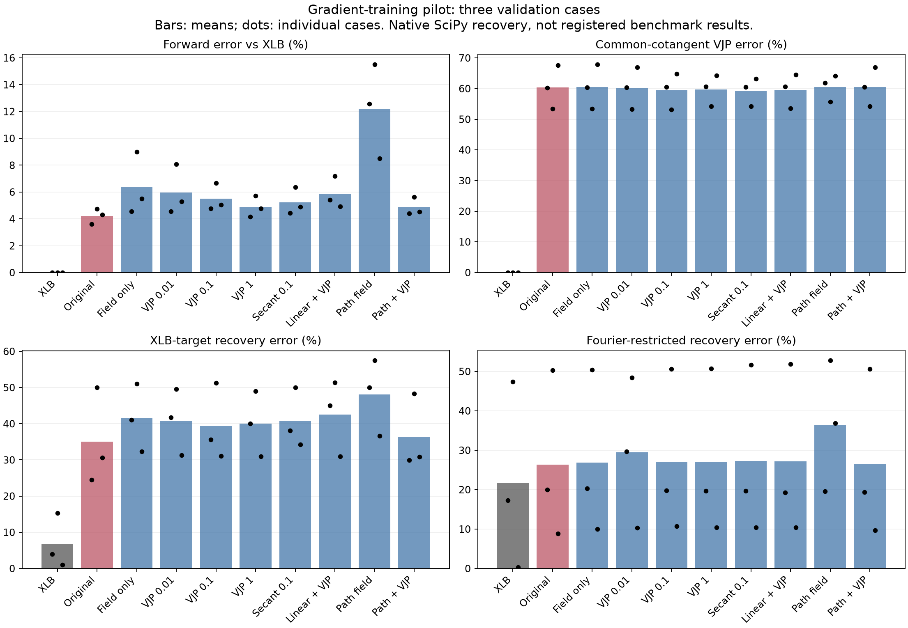

# Gradient-training pilot, October 3, 2026

None of eight 500-update fine-tuning arms improved full-space XLB-target
recovery over the shipped checkpoint on the three validation cases. The original
checkpoint was retained and selected for the subsequent registered benchmark run.
These are small pilot results, not a rejection of Sobolev training in general.

## Common validation comparison

Native JAX forwards/derivatives and SciPy L-BFGS-B, at most 100 iterations from
zero, on original dataset validation indices 5, 9, 14. These are different
cases and optimizer settings from the registered solver benchmark. Recovery
errors below use XLB-generated targets. Means over three cases; individual values
and optimizer termination information are in `results/validation.json`.

| Model | Forward error | VJP error | XLB-target IC error | Fourier-restricted IC error |
| --- | ---: | ---: | ---: | ---: |
| XLB | 0.00% | 0.00% | 6.76% | 21.66% |
| Original surrogate | 4.22% | 60.42% | 35.03% | 26.40% |
| Field only | 6.35% | 60.54% | 41.47% | 26.90% |
| VJP 0.01 | 5.98% | 60.22% | 40.86% | 29.44% |
| VJP 0.1 | 5.49% | 59.47% | 39.31% | 27.03% |
| VJP 1 | 4.89% | 59.68% | 39.99% | 26.93% |
| Secant 0.1 | 5.23% | 59.33% | 40.81% | 27.25% |
| Linear + VJP 0.1 | 5.85% | 59.58% | 42.48% | 27.20% |
| Recovery-path field only | 12.20% | 60.55% | 48.04% | 36.40% |
| Recovery-path + VJP 0.1 | 4.86% | 60.50% | 36.38% | 26.57% |

VJP errors use identical fresh random output cotangents for student and teacher.
They are not the gradients of each solver's own energy objective. Fourier
restriction applies the same projected low-frequency parameterization to every
solver and changes the inverse problem's prior. It helps the original surrogate
here but worsens XLB, so it is not an unconditional improvement.

## Training

All arms start from the same 16k-trajectory checkpoint and preserve its input and
correction normalization. They use Adam, learning rate 1e-5, batch size 1, 500
updates, seed 20261003. First-stage labels comprise 128 training and 32 validation
ICs, with random amplitude factors in {0, 0.1, 0.5, 1}. Teacher calculations use
float64 internally and float32 output; cached arrays use float32. First-order XLB
VJPs are cached. Student VJP training differentiates input derivatives with
respect to weights through native JAX; no teacher second derivatives are needed.
The secant arm uses relative RMS displacement 0.01 and ordinary weight gradients.

The optional linear branch is zero-initialized real channel mixing per squared
wavenumber shell, added alongside the original gated correction. The final two
arms use 90 labels from baseline recovery paths for eight training and two
validation targets; labels alternate random and teacher-residual cotangents.
The field-only control uses the same corresponding inputs without derivative
supervision. It is a terminal-loss continuation, not the original trajectory
curriculum objective. Each arm selects its checkpoint on its validation weighted
loss; candidate selection then uses the common XLB-target recovery metric above.

Several label-validation losses improved while common validation forward and
recovery performance worsened. Preserving the original multi-time trajectory loss
and adding replay when fine-tuning is a reasonable next experiment, but has not
been tested here. Increasing training length alone is not established as a fix.

## Reproducibility and limitations

- Code: branch `feat/surrogate-gradient-training`, commits f12717a and 245064a.
- Local unit/integration checks: 24 passed, followed by two checkpoint-loader
  tests; pre-commit checks passed.
- Existing XLB/surrogate container images with mounted source; no fresh image build.
- Queue: `nice`, one RTX 5090 per job. Training jobs 2871629 and 2871754 completed.
- Validation job 2871803 completed after correcting a cotangent dtype mismatch
  in failed job 2871648. Benchmark job 2871758 and conditioning job 2871881 also completed successfully.
- `conditioning.json` (when present) describes only a 32-dimensional sampled
  low-frequency subspace at one validation IC and three amplitudes. It is not
  the full 12,288-dimensional Jacobian or the complete low-frequency subspace.
- Three validation cases, one training seed, small label sets, one training
  budget. No claim of exhaustive hyperparameter tuning or statistical significance.
- Scripts and JSON metrics are included. Large datasets and experimental weights
  remain under `/data/personal/andrinr/runner/surrogate/gradient-pilot-20261003`.
  Their hashes appear in the training metrics and provenance. The shipped weights
  have not changed.

## Conditioning result

In the shared 32-direction low-frequency probe at zero, XLB's condition number
is 1.453 and the original surrogate's is 1.082. Despite the smaller condition
number, the surrogate's Jacobian action has 60.9% relative Frobenius error against
XLB. The linear branch reduces this mismatch to 56.0%, but does not improve
recovery. Conditioning alone therefore does not establish correct sensitivities.
These numbers describe only this sampled subspace and validation state.
