# PR 116 offline solver-in-the-loop results

These artifacts support draft PR 116. The source branch is
`feat/ns-grid-solver-in-loop` at `e52a002`, stacked on the canonical recurrent
state contract in PR 121. The reference-sensitivity numerical runs use source
snapshot `21db5ff`; the final two commits only correct the cross-reference
figure layout. The earlier nonlinear, Taylor–Green, and method-local controls
used the behaviorally identical pre-follow-up snapshot `e1133ff`; intervening
source changes add the independent reference audit and its plots.

## Benchmark state

The benchmark trains the same zero-initialized Equinox periodic residual CNN
(56,098 parameters) in two paired modes:

1. full temporal differentiation through eight autoregressive
   solver–corrector intervals;
2. the identical forward recurrence with solver state stopped at every solver
   output, reducing training to local correction supervision.

Each interval contains four native solver steps (`4 × 0.02 = 0.08`) followed
by a correction that is fed into the next solver call. Training windows span
eight intervals with no teacher forcing inside the window; held-out evaluation
free-runs 36 corrected intervals to `t=2.88`. This is best read as a temporal
credit-assignment audit, not a claim that the VJP alone makes a corrector beat
its uncorrected solver.

JAX-CFD, INS.jl, PhiFlow, and XLB carry their opt-in native checkpoint through
training, evaluation, finite-difference checks, and plotted rollouts. PICT and
Warp-NS remain velocity-complete and need no extra checkpoint. The canonical
velocity and native state are both stopped in the paired control.

All six solvers pass the nonlinear and Taylor–Green recurrence gate:

| Solver | Recurrent representation | Nonlinear closure p95 | Admitted |
|---|---|---:|:---:|
| JAX-CFD | native checkpoint | 0 | yes |
| INS.jl | native checkpoint | 2.92e-7 | yes |
| PhiFlow | native checkpoint | 4.72e-7 | yes |
| PICT | velocity-complete | 0 | yes |
| Warp-NS | velocity-complete | 0 | yes |
| XLB | native checkpoint | 1.75e-3 | yes |

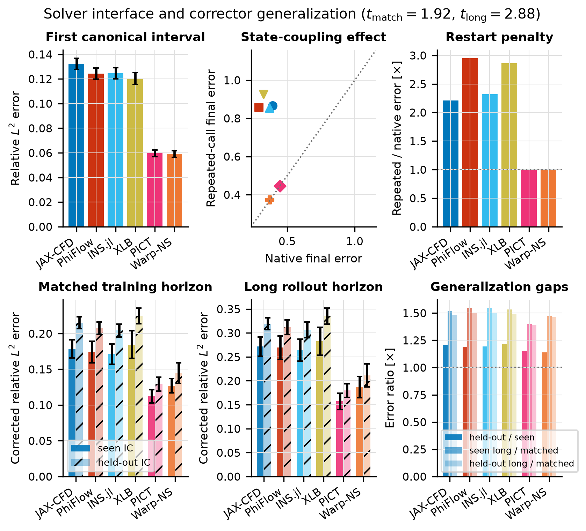

## Converged reference-sensitivity task

The common nonlinear task is repeated against independently discretized
pseudo-spectral and conservative finite-volume targets. Production targets use
128² and `dt/4`; both are gated against 256² and `dt/8` realizations before
training. The finite-volume transport uses MUSCL/minmod reconstruction and a
local Rusanov flux, with five-point diffusion and a discrete streamfunction
solve.

| Audit | Relative discrepancy | Gate |
|---|---:|:---:|
| pseudo-spectral 128² vs 256² | p95 9.89e-8; max 1.01e-7 | pass |
| finite-volume 128² vs 256² | median 0.121%; p95 0.160%; max 0.168% | pass |
| both references, all held-out frames | median 0.162%; p95 0.207%; max 0.224% | diagnostic |
| both references, final frame | median 0.196%; p95 0.222%; max 0.224% | diagnostic |

The reference comparison covers all eight held-out ICs and all 36 noninitial
evaluation frames. Agreement is specific to this smooth low-wave-number
distribution, viscosity, grid, and horizon; neither method is declared a
universally neutral ground truth.

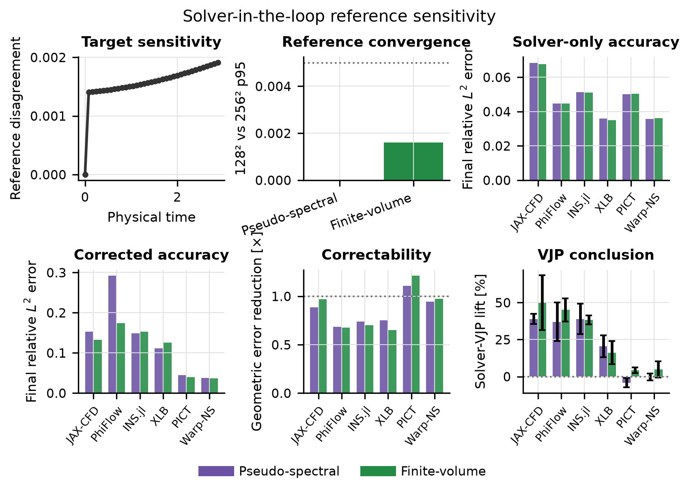

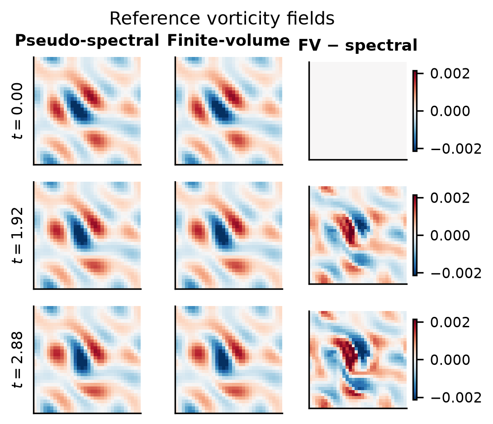

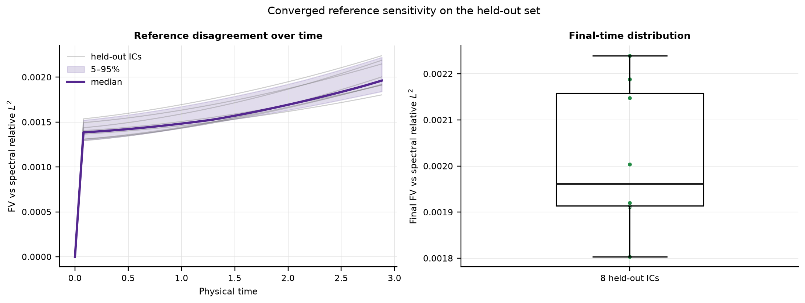

| Solver | Native final error (spectral / FV) | Corrected final error (spectral / FV) | Correction gain (spectral / FV) |
|---|---:|---:|---:|
| JAX-CFD | 0.06842 / 0.06755 | 0.1526 / 0.1321 | 0.885× / 0.967× |
| INS.jl | 0.05117 / 0.05108 | 0.1492 / 0.1526 | 0.737× / 0.701× |
| PhiFlow | 0.04461 / 0.04461 | 0.2921 / 0.1743 | 0.686× / 0.677× |
| XLB | 0.03587 / 0.03489 | 0.1117 / 0.1255 | 0.752× / 0.650× |
| PICT | 0.05016 / 0.05039 | 0.04448 / 0.03957 | 1.107× / 1.212× |
| Warp-NS | 0.03568 / 0.03608 | 0.03809 / 0.03705 | 0.946× / 0.973× |

Native final errors change by at most 2.7% between references; corrected errors
change by as much as 40.3%. PICT is the only learned corrector that beats its
native solver under both references.

| Solver | Spectral VJP lift [bootstrap 95% CI] | FV VJP lift [bootstrap 95% CI] | Conclusion |
|---|---:|---:|---|
| JAX-CFD | +39.0% [+35.6%, +42.2%] | +49.8% [+35.4%, +77.5%] | beneficial under both |
| INS.jl | +38.8% [+27.8%, +50.5%] | +38.2% [+35.8%, +41.3%] | beneficial under both |
| PhiFlow | +37.0% [+21.0%, +48.1%] | +45.1% [+38.2%, +54.3%] | beneficial under both |
| XLB | +20.5% [+13.1%, +30.2%] | +16.2% [+7.2%, +24.6%] | beneficial under both |
| PICT | −4.2% [−7.8%, −1.0%] | +4.3% [+2.1%, +6.7%] | harmful → beneficial |
| Warp-NS | −0.3% [−2.8%, +2.0%] | +4.9% [−2.0%, +10.9%] | inconclusive under both |

The paired VJP classification is reference-robust for JAX-CFD, INS.jl,
PhiFlow, XLB, and Warp-NS. PICT is the exception: its resolved effect changes
sign even though its absolute correction gain stays above one.

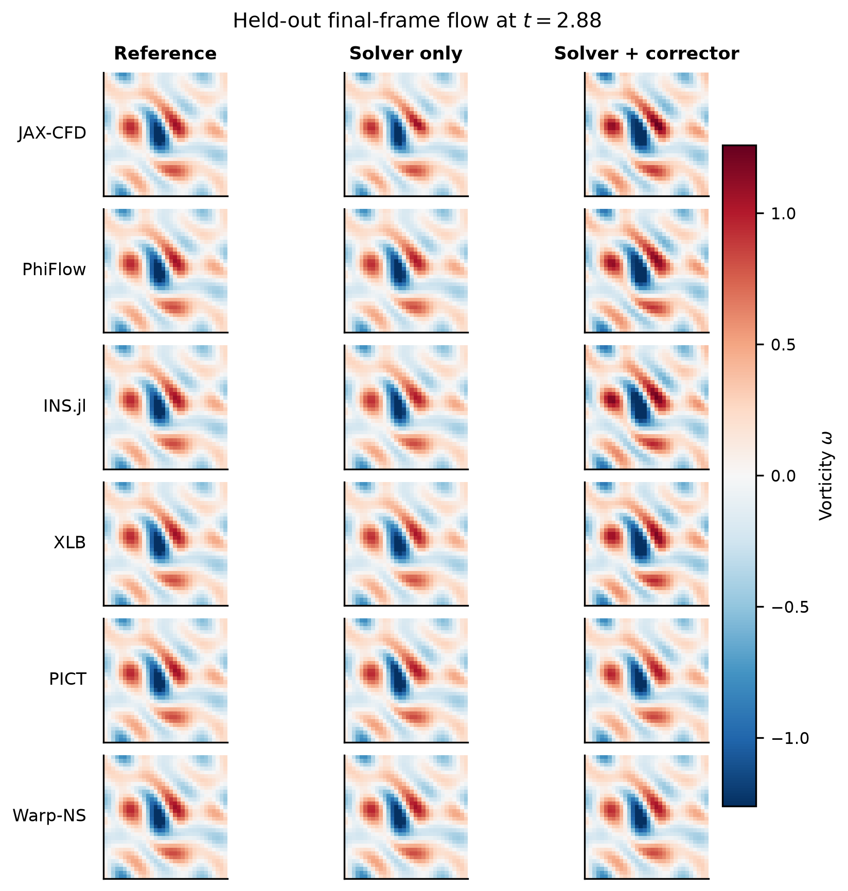

[Pseudo-spectral-reference trajectory GIF](reference-sensitivity/spectral/solver_in_loop_trajectory.gif)

[Finite-volume-reference trajectory GIF](reference-sensitivity/finite_volume/solver_in_loop_trajectory.gif)

## Nonlinear shared-reference task

The task uses a 64² dealiased pseudo-spectral reference restricted to the
shared 32² grid, 16 training ICs, eight held-out ICs, three paired model seeds,
200 optimizer updates, recurrent training to `t=1.92`, and evaluation to
`t=2.88`.

The solver-VJP lift compares full VJP with the paired stop-gradient corrector.
A correction gain above one means the full-VJP corrector also beats the
uncorrected solver.

| Solver | Correction gain | Solver-VJP lift | Bootstrap 95% CI | Corrected / solver-only error | Median update | FD rel. error |
|---|---:|---:|---:|---:|---:|---:|
| JAX-CFD | 0.886× | 31.4% | 18.7–47.7% | 0.156 / 0.0719 | 0.727 s | 1.44e-4 |
| INS.jl | 0.737× | 38.1% | 30.3–49.8% | 0.156 / 0.0553 | 0.855 s | 2.69e-4 |
| PhiFlow | 0.667× | 35.3% | 28.1–42.9% | 0.155 / 0.0466 | 0.962 s | 2.68e-4 |
| PICT | 1.244× | 2.18% | −1.11–7.34% | 0.0414 / 0.0544 | 2.322 s | 1.80e-3 |
| Warp-NS | 0.869× | −1.77% | −10.5–10.8% | 0.0445 / 0.0368 | 0.808 s | 2.48e-3 |
| XLB | 0.741× | 14.6% | 7.62–20.2% | 0.113 / 0.0364 | 0.734 s | 8.69e-5 |

PICT is the only nonlinear cell whose learned correction improves absolute
solver-only error. JAX-CFD, INS.jl, PhiFlow, and XLB nevertheless show a
statistically resolved benefit from differentiating through the solver when
compared with their paired stop-gradient correctors. Warp-NS is inconclusive.

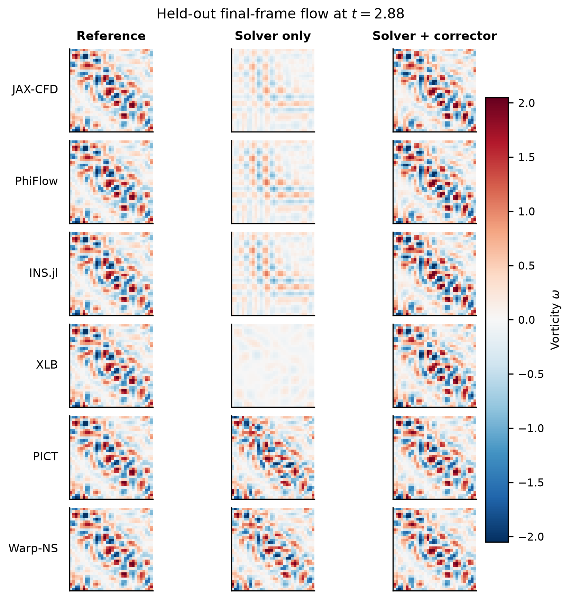

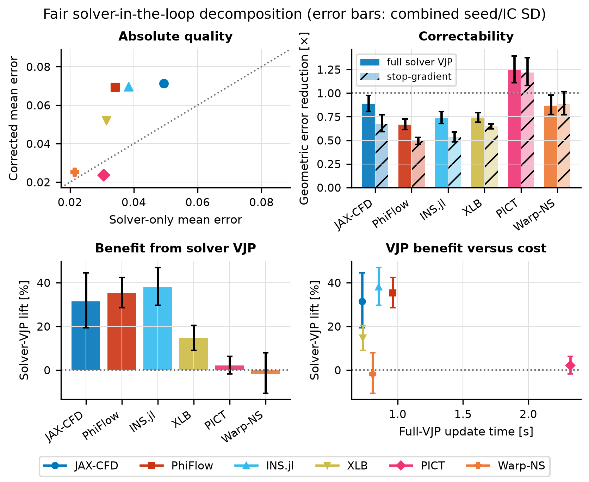

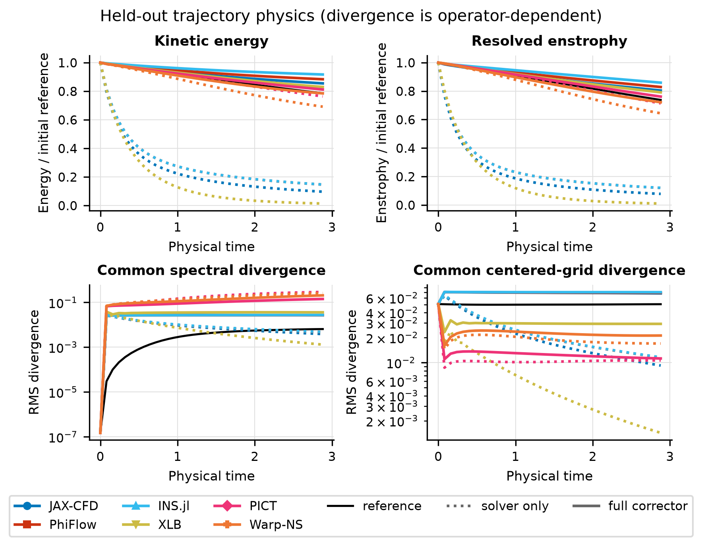

[Nonlinear trajectory GIF](multimode/solver_in_loop_trajectory.gif)

## Solver-specific refined-reference task

Each admitted cell learns against that solver's own 64², half-step reference.
Absolute errors are not compared across solvers because the targets differ.

| Solver | Correction gain | Solver-VJP lift | Bootstrap 95% CI | Corrected / solver-only error | Median update | FD rel. error |
|---|---:|---:|---:|---:|---:|---:|
| JAX-CFD | 0.669× | 37.0% | 30.0–43.9% | 0.163 / 0.0556 | 0.721 s | 1.51e-4 |
| INS.jl | 0.505× | 29.8% | 21.5–43.7% | 0.172 / 0.0413 | 0.908 s | 3.24e-4 |
| PICT | 1.119× | 4.60% | 2.47–7.29% | 0.0359 / 0.0409 | 2.328 s | 2.11e-3 |
| Warp-NS | 0.821× | −3.35% | −8.61–1.81% | 0.0363 / 0.0278 | 0.802 s | 3.40e-3 |
| XLB | 0.570× | 13.3% | 9.28–17.4% | 0.117 / 0.0269 | 0.735 s | 2.86e-4 |

PhiFlow is intentionally absent from this task. Its native checkpoint closes
the shared-reference task, but its chaotic refined self-reference audit
contains long-horizon closure spikes: maximum coarse/fine residuals are
0.0101/0.0252 and reach 22.8%/70.7% of the refinement signal. The benchmark
therefore rejects that target before training instead of presenting a
misleading comparison.

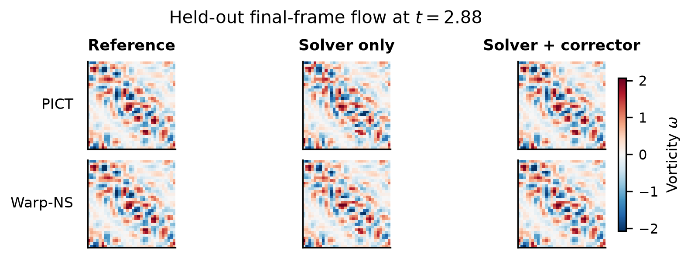

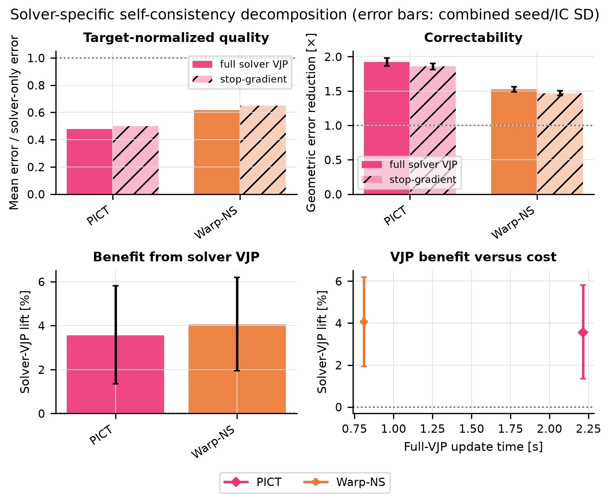

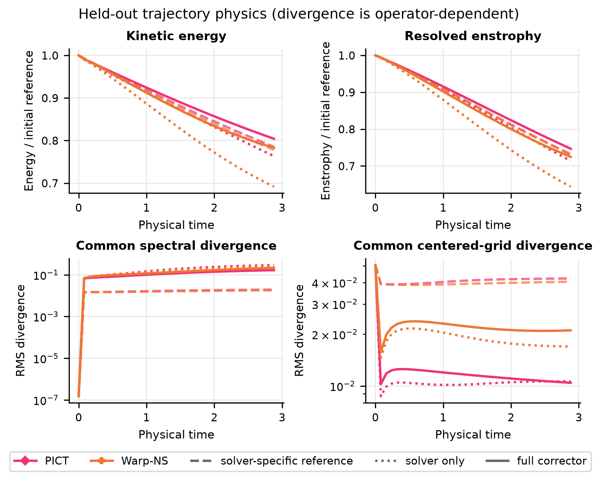

[Self-reference trajectory GIF](self-reference/solver_in_loop_trajectory.gif)

## Analytic Taylor–Green control

All six solvers are admitted in the smooth analytic control. PICT, Warp-NS,
JAX-CFD, INS.jl, and PhiFlow improve absolute error; XLB is close to neutral.
The VJP-versus-stop-gradient effect is deliberately small near this error
floor.

| Solver | Correction gain | Solver-VJP lift | Corrected / solver-only error |
|---|---:|---:|---:|
| JAX-CFD | 1.382× | 0.005% | 0.00250 / 0.00441 |
| INS.jl | 1.899× | 0.052% | 0.000579 / 0.00233 |
| PhiFlow | 1.878× | 0.047% | 0.000599 / 0.00238 |
| PICT | 1.422× | 2.20% | 5.69e-5 / 1.22e-4 |
| Warp-NS | 1.055× | 0.693% | 8.56e-5 / 9.82e-5 |
| XLB | 1.083× | 0.010% | 0.00782 / 0.00805 |

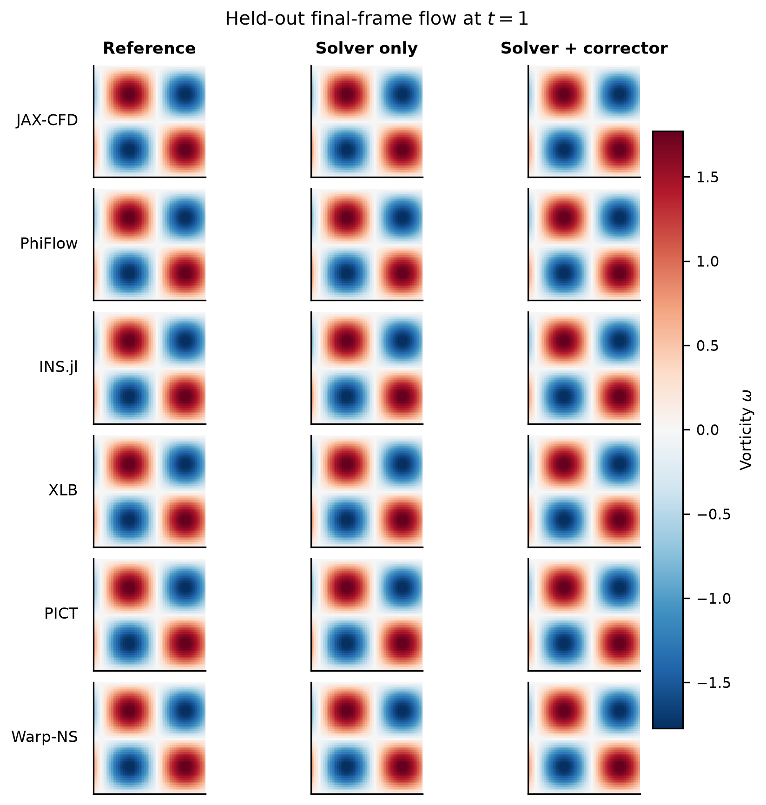

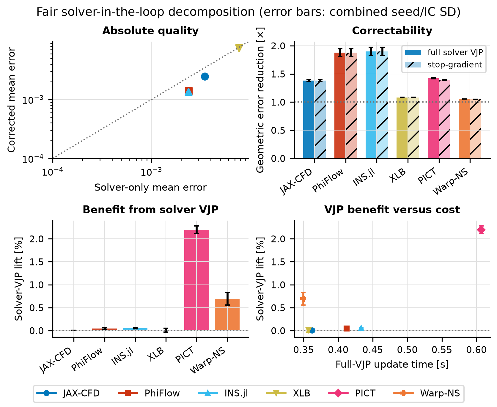

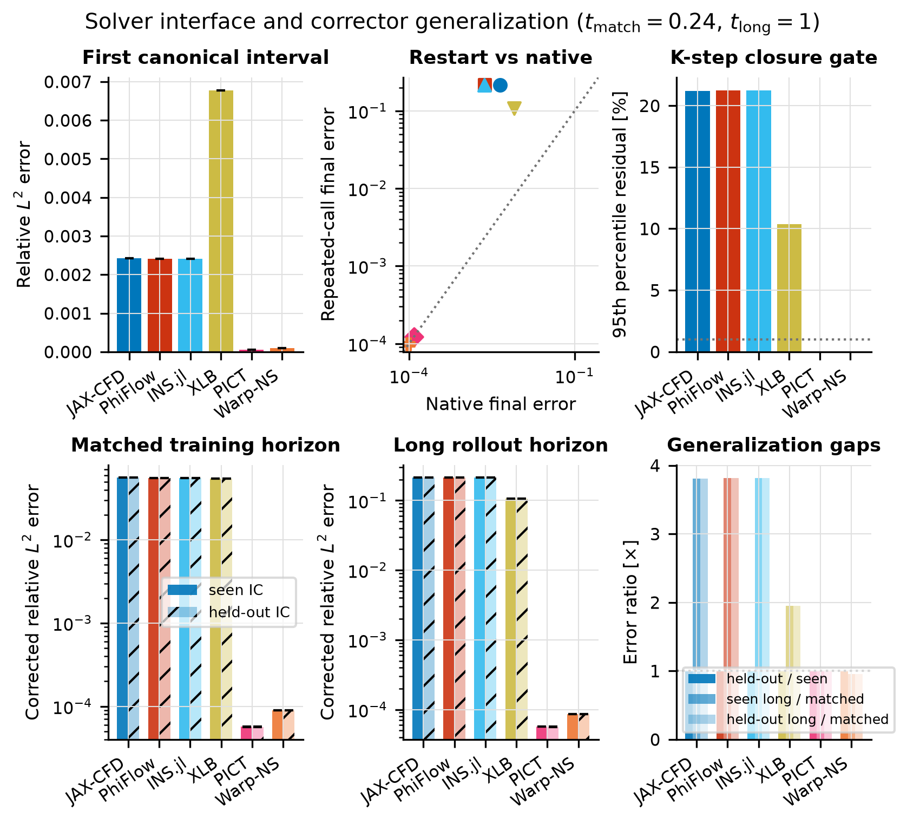

[Taylor–Green trajectory GIF](tgv/solver_in_loop_trajectory.gif)

## Files and provenance

Each result directory contains merged `result.json`, `params.json`,
`comparison_summary.json`, complete `corrector_fields.npz`, training and
rollout plots, full-field panels, fairness and physics diagnostics, and a
trajectory GIF.

Offline Kander jobs:

- reference convergence audit `1697345`; all-held-out target-disagreement
  audit `1697383`;
- reference sensitivity, pseudo-spectral: JAX-CFD `1697346`, INS.jl `1697347`,
  PhiFlow `1697348`, PICT `1697349`, Warp-NS `1697350`, XLB `1697351`;
- reference sensitivity, finite volume: JAX-CFD `1697352`, INS.jl `1697371`,
  PhiFlow `1697372`, PICT `1697373`, Warp-NS `1697374`, XLB `1697375`;
- reference-sensitivity merge/render `1697376`;
- nonlinear: JAX-CFD `1697213`, INS.jl `1697215`, PhiFlow `1697238`,
  PICT `1697199`, Warp-NS `1697218`, XLB `1697220`;
- Taylor–Green: JAX-CFD `1697182`, INS.jl `1697186`, PhiFlow `1697239`,
  PICT `1697202`, Warp-NS `1697194`, XLB `1697198`;
- self-reference: JAX-CFD `1697214`, INS.jl `1697216`, PICT `1697200`,
  Warp-NS `1697219`, XLB `1697221`; rejected PhiFlow audit `1697228`;
- existing-control merge/render `1697277`;
- source validation at `21db5ff`, job `1697344`: Ruff and format passed; 522
  tests passed and three were skipped.

No hosted benchmark label was used. PR 116 is marked `benchmark:none`; all
numerical evidence here was generated offline through the shared
Slurm/Pyxis solver tooling.
