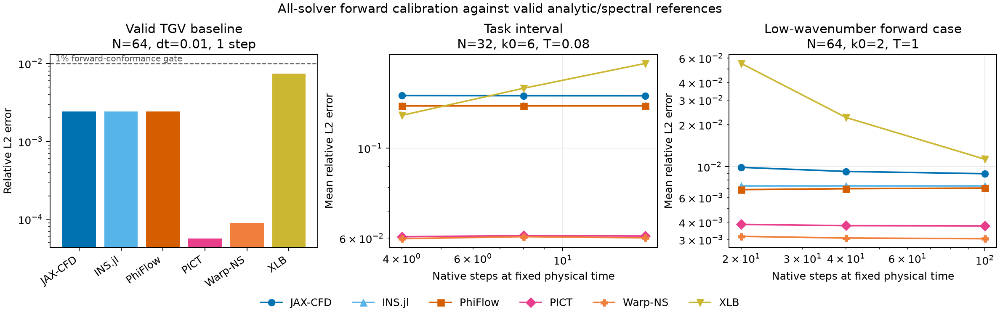

# PR 116 local Slurm artifacts

These generated results support draft PR 116 and intentionally live outside
the source diff. They were produced from the solver-in-loop implementation at
source commit `7d6a683`.

## What the benchmark measures

The benchmark trains the same zero-initialized Equinox periodic residual CNN
(56,098 parameters; not a U-Net) in two paired modes:

1. through the differentiable solver, including its VJP;
2. with the solver transition stopped, keeping all other training choices
   identical.

The nonlinear task uses a doubly periodic 32² domain, a 64² dealiased
pseudo-spectral reference, 16 training ICs (seeds 0–15), eight disjoint held-out
ICs (100–107), and a held-out rollout to `t=2.88`. The TGV control uses exact
analytic viscous decay. The self-reference task instead compares each admitted
solver with its own spatially and temporally refined trajectory.

## All-six forward and recurrence admission

No differentiable solver is omitted from the control. All six first pass an
a-priori 1% analytic forward gate. XLB receives four internal substeps per
canonical interval, the smallest tested Mach-safe budget that also passes the
uninterrupted `t=1` gate.

| Solver | First interval | Uninterrupted `t=1` | 100-call closure | Ranking eligible |
|---|---:|---:|---:|:---:|
| JAX-CFD | 0.243% | 0.441% | 21.203% | no |
| INS.jl | 0.241% | 0.233% | 21.230% | no |
| PhiFlow | 0.241% | 0.238% | 21.230% | no |
| PICT | 0.0056% | 0.0122% | 0.000% | yes |
| Warp-NS | 0.0090% | 0.0098% | 0.000% | yes |
| XLB | 0.677% | 0.804% | 10.351% | no |

Thus the initial discrepancy is not a broken forward solve. JAX-CFD, INS.jl,
and PhiFlow lose their native staggered face state at the canonical
collocated-velocity boundary. XLB reconstructs equilibrium populations on every
call, losing density and non-equilibrium moments. These adapter failures remain
visible in every all-solver plot; they are not used to rank the native VJPs.

The complete six-solver intrinsic ranking is therefore withheld. PICT and
Warp-NS form a conditional two-adapter pilot because they are the two current
interfaces that pass forward, long-forward, and recurrent-closure admission.

## Conditional nonlinear comparison

PICT and Warp-NS begin the nonlinear task at matched first-interval error
(6.32% and 6.28% p95) and both close recurrently.

| Quantity | PICT | Warp-NS |
|---|---:|---:|
| Geometric correction gain | 2.091× | 1.608× |
| Final held-out error | 0.182 | 0.207 |
| Incremental solver-VJP lift | 1.08% | 3.34% |
| Paired bootstrap 95% CI | −0.69% to 2.40% | 2.09% to 4.44% |
| Median full-VJP update | 2.234 s | 0.846 s |

Warp-NS's incremental VJP lift is distinguishably larger: its lift ratio over
PICT is 1.022× (95% CI 1.008–1.036×). PICT nevertheless produces the lower
absolute corrected error and larger total correction gain. Warp-NS is about
2.6× faster per full-VJP optimizer update.

The trajectory GIF shows reference, solver-only, and solver-plus-corrector
evolution over the complete held-out horizon:
[nonlinear trajectory GIF](multimode/solver_in_loop_trajectory.gif).

## Solver-specific refined-reference comparison

This control asks whether each solver can learn an upscaling/refinement
correction relative to its own higher-compute solution. Absolute errors are not
compared across solvers because the targets differ.

| Quantity | PICT | Warp-NS |
|---|---:|---:|
| Geometric correction gain | 1.923× | 1.527× |
| Incremental solver-VJP lift | 3.56% | 4.05% |
| Paired bootstrap 95% CI | 1.72% to 5.27% | 2.32% to 5.83% |
| Median full-VJP update | 2.214 s | 0.810 s |

Both VJPs help, but their lift difference is not significant. Warp-NS remains
about 2.7× faster.

[self-reference trajectory GIF](self-reference/solver_in_loop_trajectory.gif)

## Analytic TGV control

The forward-conformant TGV cell is a smooth, near-floor null control rather
than the nonlinear learning stress task. PICT and Warp-NS obtain incremental
VJP lifts of 2.19% and 0.69%, respectively. Their total correction gains are
1.421× and 1.055×. The other four solver cells remain present but are not
ranked because they fail recurrent closure.

[TGV trajectory GIF](tgv/solver_in_loop_trajectory.gif)

## Files and provenance

Each result directory contains merged `result.json`, `params.json`,
`comparison_summary.json`, complete `corrector_fields.npz`, the main training
and rollout plot, reference/solver/corrector fields, fairness and physics
diagnostics, and an animated trajectory. Shared-reference runs additionally
contain the all-solver admission/generalization diagnostic.

Production jobs:

- nonlinear: JAX-CFD `1642897`, INS.jl `1642898`, PhiFlow `1642899`,
  PICT `1642900`, Warp-NS `1642901`, XLB `1642902`; merge `1644051`;
- self-reference: PICT `1642930`, Warp-NS `1642931`; merge `1644052`;
- final all-six TGV: JAX-CFD `1644252`, INS.jl `1644253`, PhiFlow `1644254`,
  PICT `1644255`, Warp-NS `1644256`, XLB `1644258`; merge `1644264`;
- forward calibration: `1640390`–`1640395`; render `1644086`.

Final source validation: Ruff `1644419`, format `1644422`, full pytest
`1644423` (499 passed, three skipped), problem configs `1644424`, Tesseract
configs `1644425`, git-aware pre-commit `1644426`, and final artifact
integrity `1644825`.
