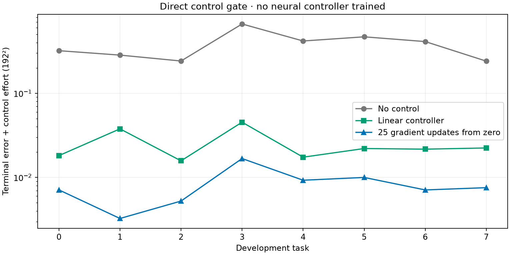

# Long horizon control gate (T = 3.2)

Eight development tasks, same-solver 64² optimization and 192² evaluation. All eight numerical gates passed. This is direct per-instance control, **not neural training or held-out confirmation**.

| Method | Mean fine-grid objective |
|---|---:|
| Zero control | 0.380778405815 |
| Linear control | 0.0250829451252 |
| 25 Adam updates from zero | 0.00829718486057 |

**Nonlinear shooting beats the linear controller on all eight tasks.** The longer horizon was selected prospectively as a development probe after inspecting the short-horizon result. This is a promising control setting, not evidence that an amortized neural policy wins.

Compare methods within each horizon: target dynamics and duration-normalized force costs change with the horizon. The same eight development seed identities are reused; they cannot become held-out confirmation.

All eight field plots and complete task diagnostics are in [report/](report/). Per-job unaggregated results are in [outcomes/](outcomes/); requested and executed configurations are both retained. [Job accounting](job-accounting.txt) and original logs preserve execution records.

Frozen source SHA256: `4bf513c30942019b10b9fc4082cc66c4c3dadc0bf0477df6824ec2b0f8cf3eba`. [Download the source archive](source.tar). Solver image path and SHA256 are in every configuration.

The eight full-field PNGs are published. Raw `fields.npz` files are roughly 21 MB per two-task job and remain on the cluster; [artifact-manifest.json](artifact-manifest.json) records exact archive/member locations, byte sizes and SHA256 hashes. No numerical fields or plots were recomputed for publication.
