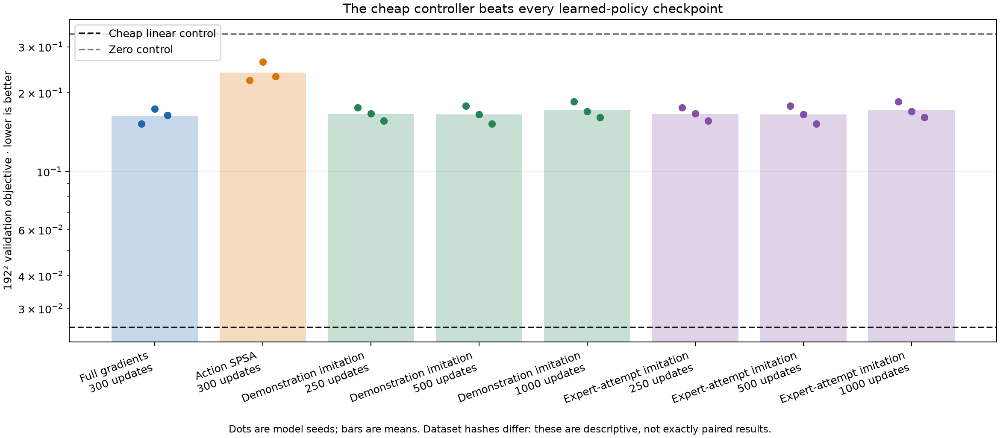
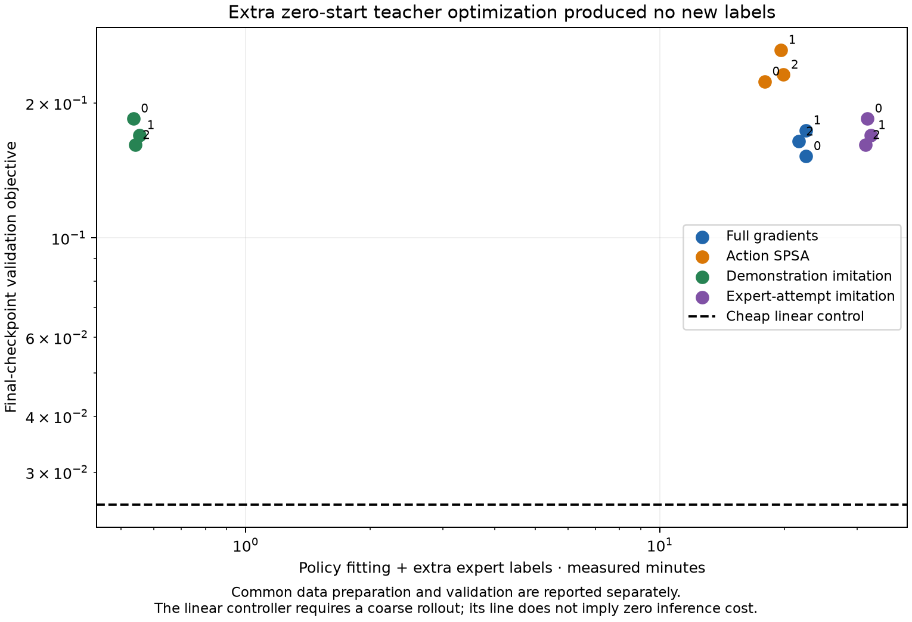
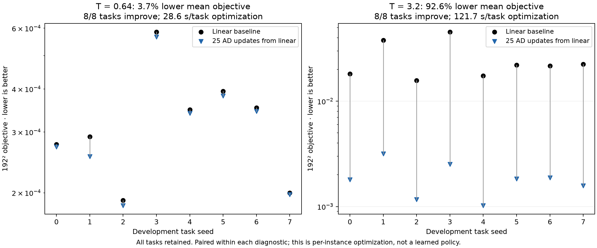
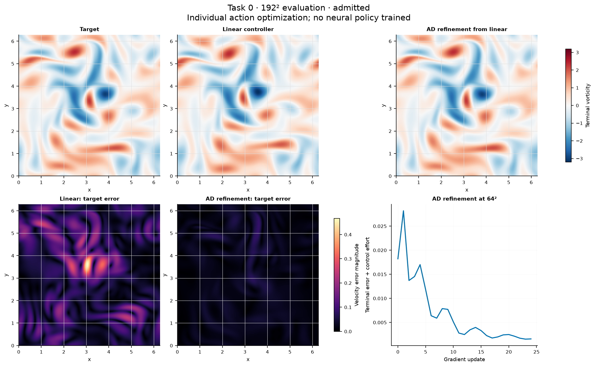
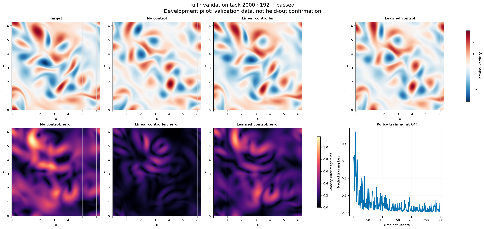

# Developmental flow-control results

Development validation only; unequal, untuned budgets. Descriptive points, no superiority or confidence-interval claim.

Exact dataset pairing: **False**. All dataset hash groups are retained in report.json.

## Learned-policy checkpoints

| Method | Updates | Model seeds | Mean objective | Seed minimum–maximum | All admitted |
|---|---:|---:|---:|---:|---|
| Demonstration imitation | 250 | 3 | 0.16620886 | 0.15627404–0.1755876 | True |
| Demonstration imitation | 500 | 3 | 0.16528301 | 0.15229187–0.17841605 | True |
| Demonstration imitation | 1000 | 3 | 0.1719553 | 0.16132841–0.1848686 | True |
| Full gradients | 300 | 3 | 0.16352695 | 0.15235149–0.17400807 | True |
| Expert-attempt imitation | 250 | 3 | 0.16620887 | 0.15627407–0.17558754 | True |
| Expert-attempt imitation | 500 | 3 | 0.16528334 | 0.15229193–0.17841706 | True |
| Expert-attempt imitation | 1000 | 3 | 0.17195523 | 0.16132695–0.18486638 | True |
| Action SPSA | 300 | 3 | 0.23935912 | 0.22355449–0.26302043 | True |

## Per-instance warm starts

| Horizon | Tasks | Linear mean | Warm AD mean | Mean reduction | AD optimization seconds/task | All admitted |
|---|---:|---:|---:|---:|---:|---|
| 0.64 | 8 | 0.00032967949 | 0.00031758149 | 3.67% | 28.56 | True |
| 3.2 | 8 | 0.025082956 | 0.0018684344 | 92.55% | 121.67 | True |

Optimization timings exclude construction and fine-grid validation of the initial linear controller.

## Complete cost ledger

| Cell | Common data s | Policy fit s | Extra labels s | Validation s | Expert labels selected/attempted | Status |
|---|---:|---:|---:|---:|---:|---|
| demonstration_imitation-0 | 681.2 | 32.2 | 0.0 | 995.3 | 0/0 | complete |
| demonstration_imitation-1 | 515.5 | 33.3 | 0.0 | 936.2 | 0/0 | complete |
| demonstration_imitation-2 | 645.2 | 32.5 | 0.0 | 801.5 | 0/0 | complete |
| full-0 | 693.9 | 1354.4 | 0.0 | 500.2 | 0/0 | complete |
| full-1 | 749.5 | 1353.5 | 0.0 | 426.0 | 0/0 | complete |
| full-2 | 735.2 | 1299.1 | 0.0 | 457.4 | 0/0 | complete |
| improved_imitation-0 | 675.8 | 32.1 | 1871.7 | 858.4 | 0/16 | complete |
| improved_imitation-1 | 508.5 | 33.2 | 1905.9 | 730.7 | 0/16 | complete |
| improved_imitation-2 | 486.9 | 33.6 | 1848.4 | 922.1 | 0/16 | complete |
| spsa-0 | 667.1 | 1076.4 | 0.0 | 507.9 | 0/0 | complete |
| spsa-1 | 628.9 | 1177.7 | 0.0 | 479.8 | 0/0 | complete |
| spsa-2 | 695.0 | 1194.6 | 0.0 | 517.8 | 0/0 | complete |

All cell statuses: {"demonstration_imitation-0": "complete", "demonstration_imitation-1": "complete", "demonstration_imitation-2": "complete", "full-0": "complete", "full-1": "complete", "full-2": "complete", "improved_imitation-0": "complete", "improved_imitation-1": "complete", "improved_imitation-2": "complete", "spsa-0": "complete", "spsa-1": "complete", "spsa-2": "complete", "warm-long-0": "complete", "warm-long-1": "complete", "warm-long-2": "complete", "warm-long-3": "complete", "warm-short-0": "complete", "warm-short-1": "complete", "warm-short-2": "complete", "warm-short-3": "complete"}

## Fixed-example full fields

