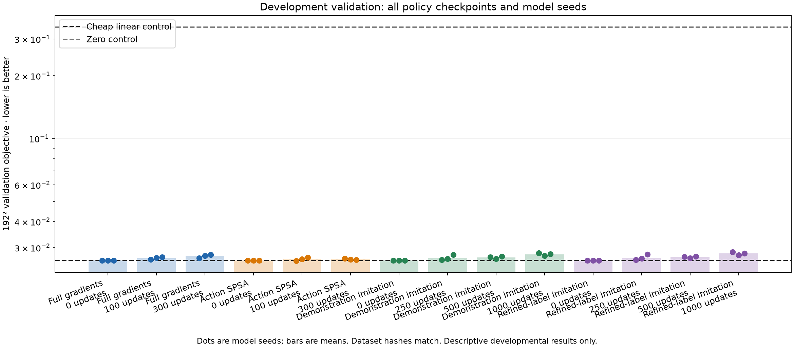
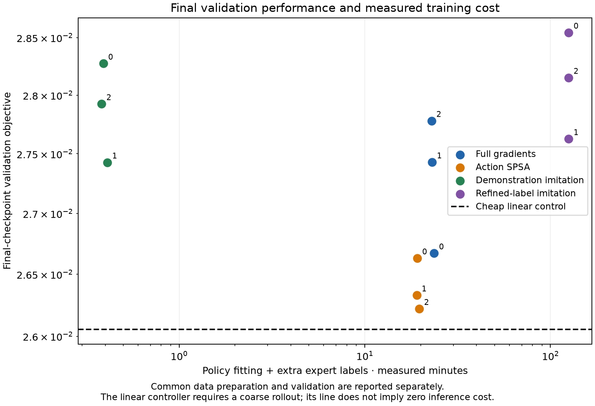
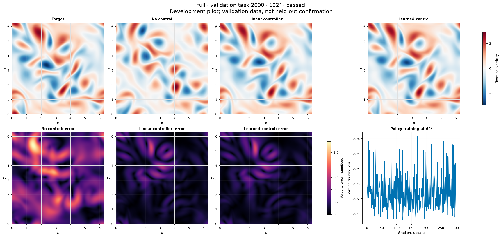

# Residual neural-control pilot: completed negative result

All 12 runs completed and passed numerical admission. Every method shares one
immutable task dataset and starts at the linear controller. The best checkpoint
averaged over three model seeds is update 0 for every method. None of the trained
mean checkpoints improves on linear control. These are validation/development
results, not untouched-test evidence, and update budgets are not matched compute.

| Method | Final mean fine objective |
| --- | ---: |
| Linear initialization | 0.02605520 |
| Full solver-gradient training | 0.02729366 |
| SPSA training | 0.02639340 |
| Demonstration imitation | 0.02787517 |
| Improved-demonstration imitation | 0.02810713 |

The task split, shared preparation costs, and all 64 teacher-label selections
are retained in dataset.json and teacher-label-choices.json. Source.tar is the
actual frozen training source; reporting-source.json identifies the report code.
All raw outcomes, executed protocols, submitted configs and Slurm identities are
included. NPZ fields and the 269 MB shared dataset remain on the cluster; their
locations and sizes are in artifact-manifest.json. No result archives were edited.
