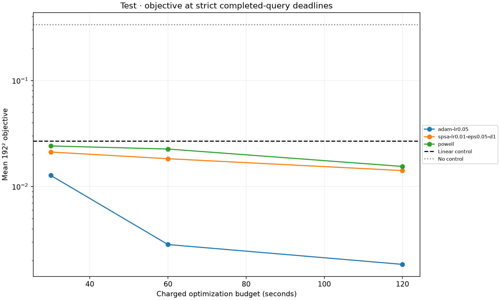
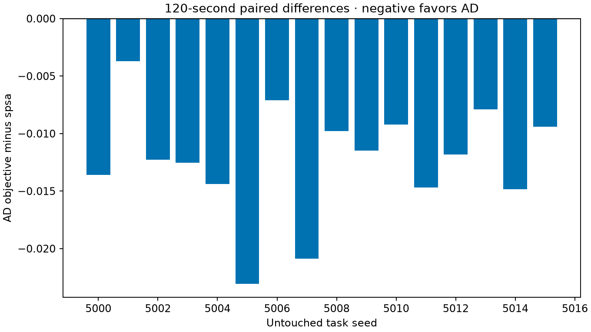
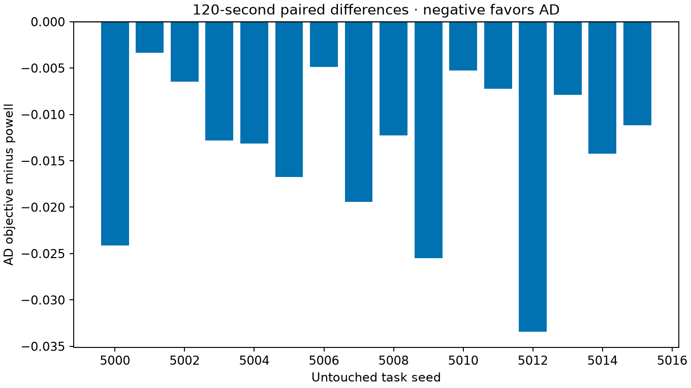
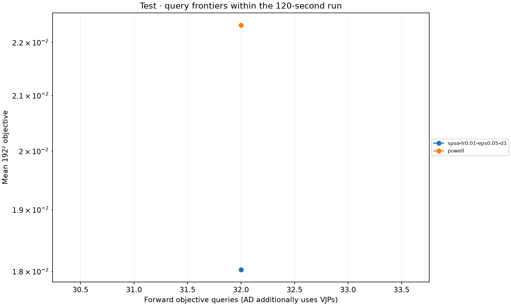
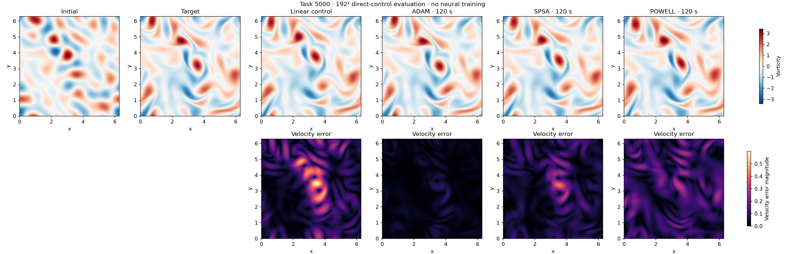
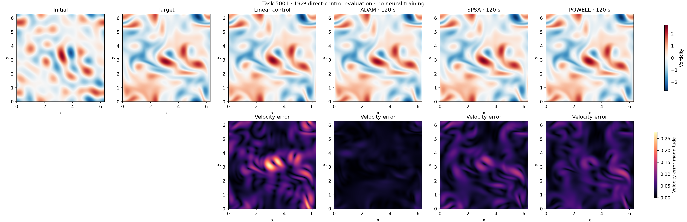
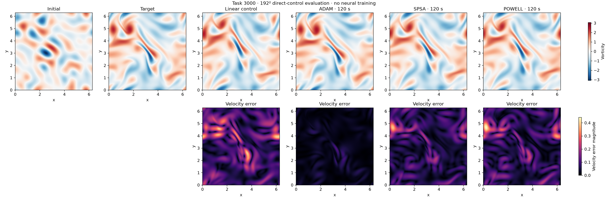
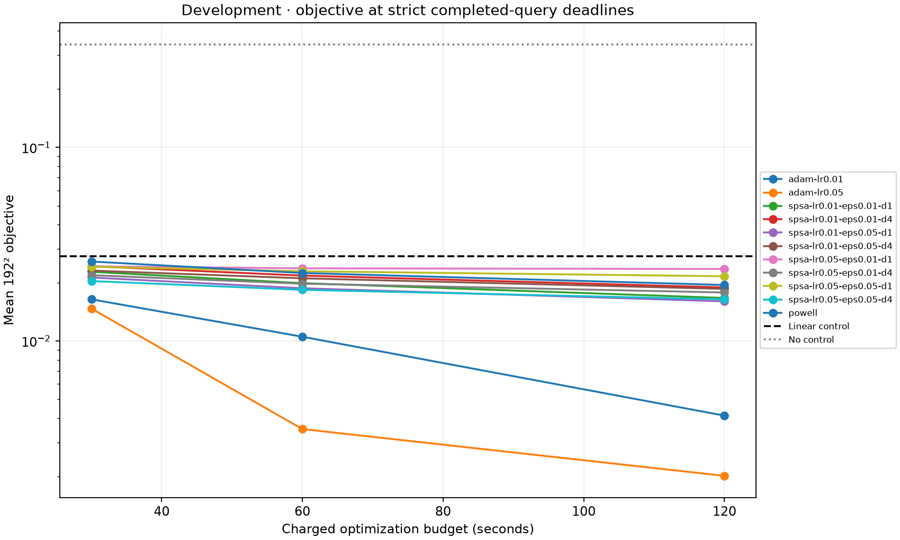
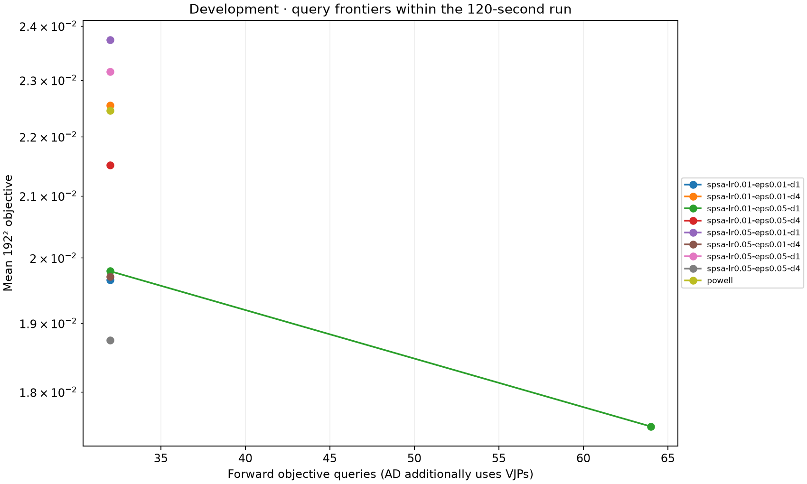

# Direct fluid-control optimization: complete development and test evidence

This experiment compares per-instance action optimization with automatic derivatives, SPSA, and Powell. It does not train a neural policy or establish a solver-in-the-loop training advantage.

Settings were selected using eight development tasks, then frozen for sixteen separate test tasks. With 120 seconds per method, mean fine-grid objective was **0.00184548 for AD**, **0.01414227 for SPSA**, and **0.01546678 for Powell**. AD won on all sixteen test tasks against each comparator; all tasks passed the recorded numerical admission checks. Controls begin from the same cheap linear controller. The solver service is already prepared; method-local initialization and first AD-call costs are charged. Fine-grid evaluation occurs afterward and cannot select optimizer candidates.

[Full development/test tables](report/README.md), [machine-readable report](report/report.json), [frozen settings selection](selections.json), [campaign plan](direct-plan.json), [raw outcomes and protocols](results/), [configs](configs/), [Slurm accounting](slurm-accounting.psv), and [source/artifact identities](manifest.json) retain the complete comparison, including all development settings and unavailable query checkpoints.

## Test results

## Fixed full-field examples

## Development settings

The exact executed source archive is included as source.tar, with readable flow-control files under frozen-source/. Large NPZ fields remain on the cluster; the manifest records the precise archive/member paths and sizes. All raw JSON outcomes, protocols, and configs are included here.
