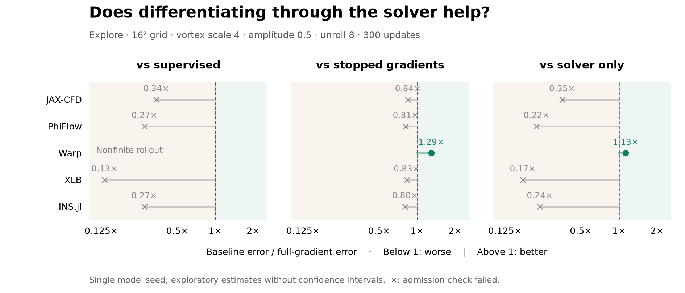
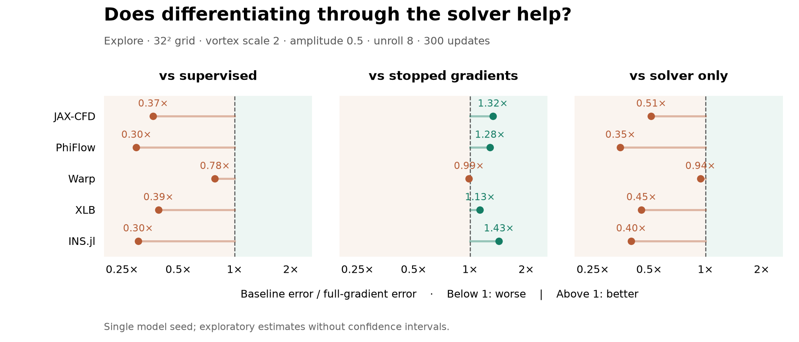
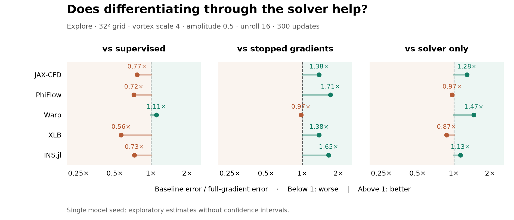
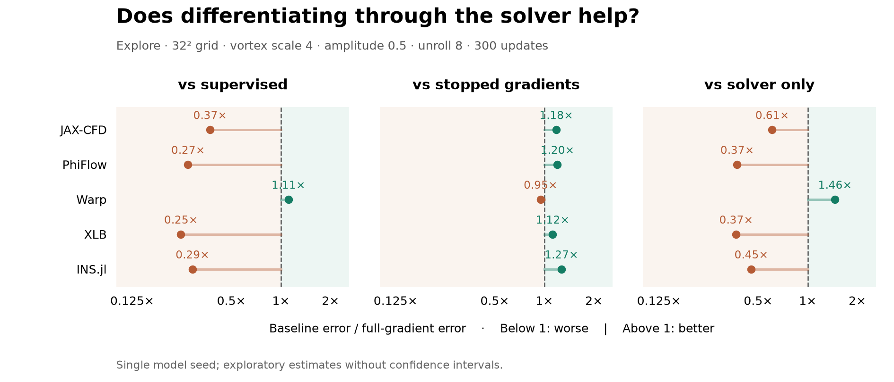

# Comparisons by setup

Each figure uses one fixed protocol and identical axes. Values above one favour full gradients.

## explore / 16² / scale 4 / amplitude 0.5 / unroll 8 / 300 updates

## explore / 32² / scale 2 / amplitude 0.5 / unroll 8 / 300 updates

## explore / 32² / scale 4 / amplitude 0.5 / unroll 16 / 300 updates

## explore / 32² / scale 4 / amplitude 0.5 / unroll 8 / 300 updates

