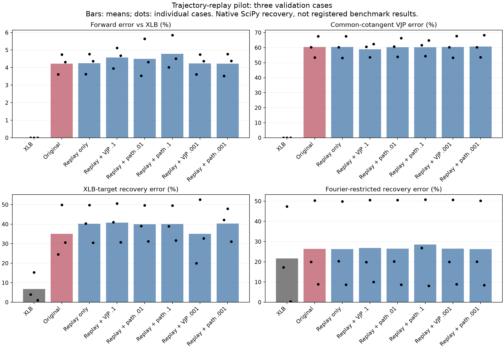

# Trajectory-replay follow-up, October 3, 2026

Six 1,000-update arms preserved the original trajectory objective while adding
derivative supervision. None beat the original checkpoint on mean full-space
XLB-target recovery across the three common validation cases. The closest
candidate, replay + random VJP weight 0.001, was effectively tied (35.12% versus
35.03%), with forward error 4.24% versus 4.22%. The original checkpoint remains
packaged. This small pilot does not establish that the methods cannot work.

## Common validation results

Same native JAX/SciPy L-BFGS-B protocol and three cases as the previous pilot,
with 100 iterations from zero. XLB and original-surrogate control results are
reused from completed job 2871803; the inference implementation and checkpoint
are unchanged. New candidates were all evaluated in job 2872655. These are not
the registered benchmark cases/optimizer settings.

| Model | Forward error | Fresh-cotangent VJP error | XLB-target IC error | Self-target IC error |
| --- | ---: | ---: | ---: | ---: |
| XLB | 0.00% | 0.00% | 6.76% | 6.76% |
| Original surrogate | 4.22% | 60.42% | 35.03% | 22.73% |
| Trajectory only | 4.25% | 60.37% | 40.18% | 23.57% |
| Replay + random VJP 0.1 | 4.58% | 58.86% | 40.81% | 27.73% |
| Replay + path VJP 0.01 | 4.49% | 60.31% | 39.99% | 20.32% |
| Replay + path VJP 0.1 | 4.79% | 60.31% | 40.09% | 20.71% |
| Replay + random VJP 0.001 | 4.24% | 60.42% | 35.12% | 22.64% |
| Replay + path VJP 0.001 | 4.23% | 60.70% | 40.38% | 28.21% |

Some path-supervised models improved self-target recovery while worsening
XLB-target recovery. Fresh-cotangent derivative improvements were small. Training
losses and self-target inversion alone therefore did not identify a better
replacement for XLB. The low-weight runs preserved forward accuracy more closely
than the previous terminal-only fine-tuning pilot, but did not improve the chosen
recovery criterion.

## Training and checks

- Shared original time-weighted field + 0.02 spectral + 0.25 terminal loss,
  plus 1e-8 parameter L2, evaluated over all 20 macro-steps.
- One replay trajectory sampled per update from the original training split,
  independently of the derivative-label RNG. All arms use the same replay stream.
- Original checkpoint input/correction normalization and original training output
  normalization retained. Dataset identity was cross-checked against the previous
  label-generation hash and normalization metadata.
- Cached-label field error is diagnostic only in replay mode; no terminal-only
  label field loss contaminates the trajectory-only control.
- Adam, constant learning rate 1e-5, batch size 1, 1,000 updates, seed 20261003.
  This preserves the original loss, not its full optimizer curriculum/schedule.
- 32 original validation trajectories plus the corresponding derivative-label
  validation split select each checkpoint by trajectory loss + weighted VJP loss.
- Weights 0.001 were added after observing the differing initial loss scales.
  Common recovery validation was not used to choose those additional weights.
- Ten training/loss tests passed, including analytic checks of the shared original
  objective and an integration test proving that changing label field targets
  cannot alter the replay-only control. Pre-commit checks passed.
- Original and new output distributions and all optimizer termination details are
  recorded in `results/validation.json`; per-step losses are in training metrics.

## Jobs and artifacts

All jobs used the `nice` queue and an RTX 5090 with existing container images and
mounted source. Training jobs 2872650 (7m21s) and 2872666 (3m31s), validation job
2872655 (9m17s), and benchmark-disposition job 2872661 (5s) all completed.

Because the original checkpoint won, job 2872661 verified hashes of the weights,
model, and API, then reused the completed 14 registered experiments from job
2871758. It did not rerun or claim new benchmark measurements. See
`results/benchmark-reuse.json` and the previous pilot's benchmark directory.

Code commit: d1d06bc on `feat/surrogate-gradient-training`. Source/script hashes
and job IDs are in `provenance.json`. Scripts and JSON metrics are included here;
large trajectories and experimental weights remain under
`/data/personal/andrinr/runner/surrogate/replay-pilot-20261003` and the referenced
prior data directories. No fresh Docker image build was performed. Limitations:
one training seed, small derivative datasets, three common validation cases,
and no statistical significance claim for the near tie.
